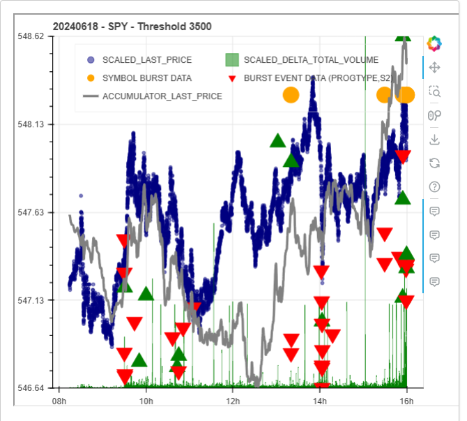

# Current Activity Log

5/27/2024

The project has come to a point where a choice needs to be made regarding what the next steps are.  The Schwab API is functional, but the documentation of some of the streaming functions is still immature.  I have subscribed to the ThetaData Standard Options Package that cost $80 per month.  Three is now an Equities package available from ThetaData but that has an additional fee of $80 associated with it.  The Schwab API is currently being used for Pricing data for underlying securities.

The automation of the data capture process is fairly mature at this time.  The framework for starting and restarting feeds is documented in the[process-automation](process-automation/ "mention") section although it is currently only implemented for the Burst Monitor server. &#x20;

At this time I am trying to determine what path to take next.  The Dashboarding and Event monitoring of HFT Burst Monitor data is fairly mature. The next steps being conserved are:

* To advance the Event Selection and Trade Execution Logic using just Burst Monitor Data and to simulate trading with this to determine effectiveness.
* To advance the Options Monitoring Functions for use as features in Event Selection Algorithms in the event that Event Selection and Trading with Burst Monitor Data proves ineffective.
* Examine approaches to get Signal Weight Data and Accumulator Information from existing Schwab API or ThetaData Equities subscription.

The purpose of generating this narrative was to document possible next steps and to make a selection.  Based on this and given that the goal of the exercise is to generate an algorithm that generates consistent cash flow, it seems that the first option above makes the most sense, in that if this works, the second option could become unnecessary or at least useful only as an enhancement to the first method.

So how would I go about executing on the first bullet detailed above? I had already been working on this in the file Burst\_Stream.ipynb.  I have observed that the Pricing Data collected using the existing Schwab\_Trades\_1.py is not clean with respect to there being a price data point for each second of time.  At this time I define a concept that I will refer to as Event\_Time\_Space which is a Space with some number of features per time point that is contiguous with one Event\_Time\_Space data point for every second of time.  The first step in moving the analysis forward would be to generate a clean Event\_Time Space that has a unique Price for every second of time.

5/28/2024

Yesterday while examining the process to cleanup the pricing data , I examined why I was doing this and it was to be sure that I would have data for the Event\_Date\_Time that Burst Events occurred and since I have added an independent data capture of that information as part of the Burst Monitoring process I decided that for now at least that that step was not necessary.   The current work on the Burst streaming is under development in Burst\_Stream\_3 and I updated this to add both the Size and Volume values returned when the Event occurs.

6/1/2024

Have examples of Schwab Streaming data and an interesting market event in the 5/31/2024 trading to review.  The order of work here is to firm up the way that general streaming data is capture, archived and recovered for analysis. &#x20;

6/6/2024

Have been working on processing streaming data from Schwab API for the past few days in the Burst\_Stream.ipynb file.  This morning the Refresh Token for the Schwab file expired.  The update process for this is as follows:

1. Be sure that the current working directory is the Code directory for the project.
2. Start node-red by typing node-red at the command prompt of an active terminal.
3. Spawn a Browser and navigate to https://127.0.0.1:1880/ui that has the Control Button Dashboard
4. Click on the Update Refresh Token Button.  This will execute obtain\_new\_refresh\_token.py
5. A Schwab Login will appear, log in with account credentials. &#x20;
6. Accept the disclaimers and indicate what accounts should have API access.
7. When you hit Done a webpage will appear with a an access error.  Click advanced on this page and select the link to allow it to continue anyway.
8. A new token file should now be present in the working directory with the name specified n the config.py file for the token file.
9. When the authorization code appears, the process is complete.
10. Copy the token file to any machines that need to access the API.

This process ran without incident an a new refresh token was generated.  My Token tracking indicates that this refresh token will expire on 6/13/2024 at 06:21 AM. &#x20;

The objective for today is to document the work from the last few days to capture the details of how the analysis is implemented.  This has been specifically in the area of processing captured data from various endpoints including streaming endpoints.  I have also begun the process of using Holoviews the generate static HTML files that can be then used in the Node-red Dashboard 2.0 Information Displays.

6/19/2024

Spent the last few days firming up how to post process NDJSON capture files and integrate result into Dashboard 2.0 display.  The essence of the work is to take the NDJSON files created by Levelone streaming data from Schwab, the HFT1 symbol stream and the Burst\_Data event with included symbol data, to create Polars dataframes from each and then generate a Plot of the data.

These plots are saved with a filename of  YYYYMMDD\_SYMBOL\_output.html format.  For display purposes. a ui-template is used to generate v-cards into which are stored iframe images whose src is the various html file.  The ui-template is fed by a msg.payload from the Date Select Widget which has the data desired for display.

The goal is to be able to display past data for selected dates and to have a running display of the current data as it comes in during the daily market session.  Here is an example of the current state of the plot.

<figure><figcaption><p>Daily Plot Sample</p></figcaption></figure>

In this the Orange Circles are events where the HFT1 NumQuotes exceeds the threshold value listed, plotted at the current last trade price.  It appears that at times this may not line up correctly with the Current last trade price which is plotted in Blue,  and it is not clear at this time why that is.   The Green and Red Arrows mark events that are flagged as Burst\_Data.  If the event is flagged as a ProgType Sell it is marked as an inverted red triangle and if it is flagged as a ProgType Buy it is marked by a green triangle.  The triangle used to mark events is placed at a height in the chart that is the value of S2 recorded for that event.  A green or red arrow only shows up for an event if the Sybmbol being plotted is included in the Symbol\_List associated with that event.  The Green bars reper4sent the change in volume for one Levelone quote to the next.  The grey line in this plot is an accumulator value that is derived by testing whether the next tick in the Levelone stream is higher or lower in price than the previous price and incremented by one or decrementing by one to calculate the accumulated value.  At this time the question of how an accumulator value should be calculated is an open question.

At this time I am trying to define the details of how the intraday chart is made and how that it archived at the end of the day.  I am currently thinking that the datframes that are generated as part of the plotting process will be the long term storage vehicle for the data, but that is as of now still uncertain.

7/9/2024

Work over the past few weeks has been concentrating on getting the plotting of the HFT data automated and displayed on the dashboard.  This has been accomplished with the use of the v-datepicker to select a data and the display of static html selected by using filenames that incorporate the date derived from the datepicker.  These static html file can be generated using Burst\_stream.ipynb at any time during the day and take approximately 10 seconds to generate.  At this time the generation takes place based on the NDJSON files that are captured for the day and the dataframes associated with this data are regenerated each tome the plotting process is run.    Between yesterday and today I implemented a dynamic threshold generation capability that calculates the mean and standard deviation of the NumQuotes Measurement and the Dollars measurement and only displays round orange dot for those instances where the selected parameter exceeds 2 standard deviation units above the mean.  This reduces the amount of noise in the plots .  IN the event that there are no points that are 2 std units above the mean the criteria is rolled back to 1 std unit above the mean.

At this point I still manually trigger the chart generation, but it is time to now solve the issue of how the automatic triggering will be done and how the data will be archived.  This choice should also address the issue that the entire dataframes for the day is generated  each time the plots are generated.  This seems wasteful and the solution to this waste should be incorporated with the resolution of how the data will be archived, presumably in full day parquet files.

7/10/2024

Currently I have implemented a Python Script to generate the Burst Monitor plots and have it executing in node-red based on an inject node running once per minute.  EEachtime this script runs it takes the entire NDJAON files for the day, convert them to dataframes and generate the plots based on these dataframes.  This is incredibly wasteful in that it redoes the dataframe for the entire day every time the script is run when only a limited number of new NDJSON records need to be processed and added to the dataframes.  If the dataframes are to be persistent and only the new data added. The script will need to be made asynchronous and run within a loop.  Other data capture routines that have been implemented in this project do this for instance, Burst\_STream\_3.py which does this which processes the incoming .csv file from Burst Monitor and uses aa pickle file to track where the processing has left off so that if data capture is interrupted it know where to pick up from when the service is restored.  This runs in a node-red Daemon node continuously throughout the day.  This general approach is what needs to be implemented for the Update\_Burst\_Plots.py script.  At the end of the day the dataframes that have been generated incrementally through this process should be archived in a separate folder in parquet format for later recall and use in modelling and backtesting.

This is straightforward an I have done it before, but for some reason I am having a difficult time determining just how to best do it in this case.  To break this brain freeze lets take it one step at a time.

First you need to  know what files you are working with. &#x20;

````
/```python
if __name__ == "__main__":

    # current_date = datetime.strptime('7 08 2024', '%m %d %Y').date()
    current_date = datetime.now().date()
    # Format the date as 'yyyymmdd'
    formatted_date = current_date.strftime('%Y%m%d')
    # print(formatted_date)
    levelone_equities_file=f'{formatted_date}_messages.ndjson'
    burst_analysis_file = f'./Processed_Data/{formatted_date}_processed.json'
    burst_analysis_1_file =f'./Processed_Data/{formatted_date}_processed_1.json'
    
    levelone_equities_progress_file=f'{formatted_date}_messages.pkl'
    burst_analysis_progress_file = f'./Processed_Data/{formatted_date}_processed.pkl'
    burst_analysis_1_progress_file =f'./Processed_Data/{formatted_date}_processed_1.pkl'
    
    
```
````

Need to be sure the files exist and possibly check for the pickle file to see if this is just the beginning or if previous processing has taken place

````
```
# List of progress files to check
progress_files = [levelone_equities_progress_file, levelone_equities_progress_file, burst_analysis_1_progress_file]

for progress_file in progress_files:
    # Load the last size from a pickle file if it exists
    if os.path.exists(progress_file):
        with open(progress_file, 'rb') as f:
            last_size = pickle.load(f)
    else:
        last_size = 0
```
````

Looking at this leads me to think there should be a function to which you supply a base filename to.

````
```python
def process_data_file(filename):
        # Load the last size from a pickle file if it exists
        if os.path.exists(f'{filename}.pkl'):
            with open(filename, 'rb') as f:
                last_size = pickle.load(f)
        else:
            last_size = 0
```
````

Then again, looking at the existing code there is this section tat begs the issue of ether the existing functions that read the full file into dataframes should each be refactored to handle incremental changes.

````
```python
def Generate_Dataframes(levelone_file, hft1_data_file, burst_data_file):
    # Read the data
    df1 = Read_LevelOne_Equities_Data(levelone_file)
    df2 = Read_HFT1_Burst_Data(hft1_data_file)
    df3 = Read_Data_Burst_Data(burst_data_file)
    return df1, df2, df3
```
````

A sample of one of these routines is as follows:

````
```python
def Read_HFT1_Burst_Data(burst_analysis_file):
    burst_base_schema = {
        "Symbol": pl.String,
        "Event_Date_Time": pl.Datetime,
        "NumQuotes":   pl.String,
        "BBO":   pl.String,
        "NumTrades":   pl.String,
        "Dollars":  pl.String,
        "Trade_Size": pl.Float64,
        "Price": pl.Float64,
        "Size": pl.Int64,
        "Volume": pl.Int64
    }

    df1 = pl.read_ndjson(burst_analysis_file, schema=burst_base_schema)
    fields_to_convert = ['NumQuotes', 'BBO', 'NumTrades', 'Dollars']  # replace with your actual fields

    for field in fields_to_convert:
        df1 = df1.with_columns(df1[field].cast(pl.Int64))

    # Combine mean and standard deviation calculations into a single aggregation
    aggregated_df = df1.group_by("Symbol").agg([
        pl.col("Dollars").mean().alias("MeanDollars"),
        pl.col("Dollars").std().alias("StdDollars"),
        pl.col("NumQuotes").mean().alias("MeanNumQuotes"),
        pl.col("NumQuotes").std().alias("StdNumQuotes")
    ])

    # Join the original DataFrame with the aggregated results
    df1 = df1.join(aggregated_df, on="Symbol", how="left")

    return df1
```
````

If this is to be refactored likely you would pass in the existing dataframe  and an updated version would be returned.  Right now I am thinking this might be the ticket.  Here a refactor of the initial setting of df1 to take a dataframe passed as a parameter and read a new\_data data, process it and add it to the original dataframe might be the most straight forward way of working this in.

7/12/2024

Addressing this first thing this morning in an attempt to get past the block.  When I left off yesterday I realize that proceeding down that path would address the incremental updating but that in order to keep the dataframe persistent in memory, it would be necessary to refactor to operate in an endless asynchronous loop.  When I do this I also add mqtt so that at stop message can be sent for a graceful exit and an end time exit capability.  Consulting with Copilot suggests generating a class.:

```
class DataAnalysis:
    def __init__(self):
        self.df1 = None
        self.df2 = None
        self.df3 = None

    def load_data(self, levelone_file, hft1_data_file, burst_data_file):
        # Assuming Read_LevelOne_Equities_Data, Read_HFT1_Burst_Data, and Read_Data_Burst_Data are defined elsewhere
        self.df1 = Read_LevelOne_Equities_Data(levelone_file)
        self.df2 = Read_HFT1_Burst_Data(hft1_data_file)
        self.df3 = Read_Data_Burst_Data(burst_data_file)

    def generate_plot(self, analysis_symbol, threshold, formatted_date):
        # Access the DataFrames directly from the class attributes
        # Example: Use self.df1, self.df2, and self.df3 for plotting
        pass  # Implement the plotting logic here

# Usage
analysis = DataAnalysis()
analysis.load_data(levelone_file="path_to_levelone_file", hft1_data_file="path_to_hft1_file", burst_data_file="path_to_burst_file")
analysis.generate_plot(analysis_symbol="AAPL", threshold=100, formatted_date="2023-04-01")
```

Hit the wall again,  going back to first principles.  Why do I store data in incomplete form in NDJSON files as it comes in.  I do this because I want to minimize the amount of processing done at this stage to allow for the maximum possible data transfer bandwidth in realtime.  In the case of Burst Monitor data this is done by Burst\_stream\_3.py right now.  This routine monitors .csv files that are created by the Burst Monitor Client program based on a compressed data feed coming from HFTAlert.  In this case the problem is dealt with by creating a dictionary of rows and converting them to ndjsoas follows:

````
```python
def monitor_burst_stream(most_recent_file_1,output_file_1,topic_1,client,last_size):
    global current_time,formatted_date
    # Load the last size from a pickle file if it exists
    progress_file= f'./Processed_data/{formatted_date}_Burst_last_size.pkl'
    if os.path.exists(progress_file):
        with open(progress_file, 'rb') as f:
            last_size = pickle.load(f)

    # Check if the file has changed
    current_size = os.stat(most_recent_file_1).st_size
    #print(f"Current Sobroutine Size: {current_size}")
    min_time=None
    row_dict = {}

    if current_size != last_size:
        # The file has changed, open it and read from the point where we left off
        with open(most_recent_file_1, 'r') as f:
            # Seek to the position of the last read
            f.seek(last_size)
            # Read the new lines
            new_lines = f.readlines()

            # Process the new lines into JSON and write them to a new file
            with open(output_file_1, 'a') as f1:
                for line in csv.reader(new_lines):
                    # Create a dictionary for each line
                    row_dict = dict(zip(['Event_Date_Time', 'Grade', 'ProgType', 'Bckgrnd', 'S1', 'S2','CT','CS','CB'], line)) 
                    temp_date = extract_date_from_filename_datetime(most_recent_file_1)

                    #wrap with try/except block in case symbols are not there
                    try:
                        with open(f'./Data_Burst_Symbols/Burst_{temp_date.strftime("%Y%m%d")}_{row_dict["Event_Date_Time"]}.csv', 'r') as f2:
                            rows = list(csv.reader(f2))
                            row_dict['Burst_Symbols'] = [{"Symbol": row[0], "NumTrades": row[1], "NumQuotes": row[2], "BBO": row[3]} for row in rows]
                            # row_dict['Burst_Symbols'] = rows
                    except Exception as e:  # Catching any exception
                            print(f"An error occurred: {e}")  # Optionally log the error or take other actions
                            row_dict['Burst_Symbols'] = []

                    # Convert 'Event_Date_Time' from int to time
                    row_dict['Event_Date_Time'] = int_to_time(row_dict['Event_Date_Time'])
                    # Combine 'Event_Date_Time' with temp_date
                    row_dict['Event_Date_Time'] = datetime.combine(temp_date, row_dict['Event_Date_Time'])
                    # Convert 'Event_Date_Time' to a string in ISO 8601 format
                    row_dict['Event_Date_Time'] = row_dict['Event_Date_Time'].isoformat()
                    if min_time is None:
                        min_time = datetime.fromisoformat(row_dict['Event_Date_Time'])
                    # Write the dictionary as a JSON object to the file

                    # Convert the dictionary to a JSON string
                    row_dict_str = json.dumps(row_dict)
                                    
                    # Write the dictionary as a JSON object to the file
                    f1.write(row_dict_str+ '\n')
                    client.publish("data_burst", row_dict_str)
            
        # Update the last size
        last_size = current_size
        # Save the last size to a pickle file
        with open(progress_file, 'wb') as f:
            pickle.dump(last_size, f)

        if 'Event_Date_Time' not in row_dict:
            return  last_size

        max_time = datetime.fromisoformat(row_dict['Event_Date_Time'])
        # Calculate the time difference
        time_diff = max_time - min_time
        # Get the number of lines
        num_lines = len(new_lines)
        try:
            bps = num_lines / time_diff.total_seconds()
        except ZeroDivisionError:
            bps=0
        min_time=None  

    return last_size
```
````

7/12/2024

Did not resolve the issue of the incremental updating of dataframes in the Burst Monitor Analysis yet, but di run the non-incremental version all day with one a minute updates and good results.  Ther is an issue to be resolved of how to cause the Dashboard 2.0 display to update when the underlying plot file change, but for now clicking date selections is a workaround.

I had previously gotten a note from Bailey at ThetaData regrading the old ticket that had issue related to restarting or reconnecting to the streaming server (FPSS) when issues occur during the day.  I have not been working with the options feed lately, but I believe this to be fixed.  At any rate Bailey reached out and suggested I update to Terminal 1.6.4 and let him know if the ticket can be closed.  This prompted me to have to refresh my memory on how the Terminal Server is setup and since it took a few minutes to recall this, I have decided it should be documented here.

As it is setup now, the bat file below spawns an instance of the ThetaData Terminal.

```
/start cmd /k "C:\\Users\\vandel\\Desktop\\Projects\\HFT\\ThetaData\\ThetaTerminal\\ThetaTerminal.bat"
```

The .bat file itself is:

```
@echo off
cd /d "%~dp0"
java -jar ThetaTerminal.jar vandel@gmail.com THE!vandel883
PAUSE
```

There is also a .bat file to start the Stage Server which if my memory serves me correctly runs a daily tape from date in the past on the FPSS server so that debugging can occur during non-market hours.  This .bat file is named ThetaTerminal\_Stage.bat and contain the following:

```
/java -jar ThetaTerminal.jar vandel@gmail.com THE!vandel883 line=1
PAUSE
```

The addition of line -1 refers to an entry in the config file that is located at a location the is printed during the startup phase of the .bat file and in my case it is:

```
C:\Users\vandel\ThetaData\ThetaTerminal
```

If the line parameter is not provided on launch the file that is used is config\_0.porperties.  If the parameter is set to line=1, the file that is used is config\_1.properties.  With the config file are the details of what server should be attached to.  The details of all of this appear on the Thetadata website.  Getting started is located [https://http-docs.thetadata.us/docs/theta-data-rest-api-v2/4g9ms9h4009k0-getting-started](https://http-docs.thetadata.us/docs/theta-data-rest-api-v2/4g9ms9h4009k0-getting-started) and the details of the config file are located here [https://http-docs.thetadata.us/docs/theta-data-rest-api-v2/8dqa3ohk72su6-the-config-file](https://http-docs.thetadata.us/docs/theta-data-rest-api-v2/8dqa3ohk72su6-the-config-file).

7/13/2024

Back on the issue of getting the dataframe for the plots generated incrementally I started a new file Burst\_Stream\_4 and had the routine  monitor\_hft1\_stream accept a dataframe and return a dataframe updated with the new information found in rwo\_dict.   I did the same for monitor\_burst\_stream.  These are the two routines that generate {FormattedDate}.proccessed.json and {FormattedDate}.proccessed\_1.json that are read and converted to a datframe by the plotting functions. and hence the dataframes are available and are built incrementally as the data capture occurs. &#x20;

I also pulled the Plot code that was executing in Update\_Burst\_Plots .  As a placeholder I pulled the full read version of Read\_Level\_one equites function and added it since there was no incremental read capab**ilty, or any read capability for this in the original Burst\_Stream functionality.  Making this incremental will be deferred until the rest of the functionality is working.**

Upon getting the quit message save the dataframes to parquet.   Got the refactor to the tt esting point and called it a day.  Will test tomorrow.

7/14/2024

Begin testing of Burst\_Strem\_4.  The first thing that comes up is the fact that the dataframe updates made before plotting change the form of the dataframe making the concat in the initial capture fail as only dataframes of the same form can be concatenated.  in troubleshooting of this I will document the choices made with respect to dataframe form here for clarity.

The bottom level data capture routines run most frequently and process the most basic information that is coming in incrementally with only new information being read with each iteration.  Right now this is done within a 10 second loop.  In the case of the HFT1 data, the changes to the Burst\_Monitor server captuered .csv file are processed and since these do not contain price information, Price,(regularMarketLastPrice), volume(totalVolume) and size(regularMarketLastSize) information are obtained from the Schwab Quote endpoint to supplement the date provided by the Burst\_Monitor Server.  In addition the Trade\_Size is calculated based on the Burst\_Monitor provided Dollars and NumTrades information. The only additional calculations done at this point is the calculation of the current Event\_Date\_Time from the filename and the timestamp.  these things are all accomplished in the monitor\_hft1\_stream function.  This provides a dataframe with 12 columns ('Symbol', 'T1', 'Event\_Date\_Time', 'NumQuotes', 'BBO', 'NumTrades', 'Dollars','T3','Price',Size','Volume','Trade\_Size').

The next level of processing involves the generation of visualization plots and this is currently set to take place every 6 iterations (once per minute).  The visualizations use a variable threshold to provide that only the largest Events appear in the visualization.  This is handled by calculating the mean and standard deviation of the Dollars and NumQuotes on a per symbol basis.  Since this requires all of the data to calculate, it can not be captured at the bottom level and is calculated just before the visualizations are generated.  This process adds four columns ('MeanDollars', 'StdDollars', 'MeanNumQuotes', 'StdNumQuotes') to the dataframe.  This necessitates a new dataframe instance so that the form of the original dataframe remains unchanged for subsequent incremental updates.

The monitor\_burst\_stream routine monitors the Events and handles the integration of the symbol list into the dataframe.  In the visualizations of individual symbols a check is done to see if the selected symbol is included in the symbols reported and only adds a event indicator (Green Up Arrow or Red Down Arrow) in the visualization.  This process also involves things done at the bottm level and things doe immediately before visualization.  Here it may be possible to move this to the bottom\_level as no new statistics are being generated but the fact that the Burst\_symbol field has a variable number of items may cause issues with concatenation so will leave it at this level.

As the debugging has been coming along, I have been replaying previous data which since it is already captured for the full day does not benefit from incremental execution.   this was taking quite a bit of time and I realize that this is because of the response time of the requests to the quote endpoint that I had been using prior to getting the levelone streaming going.    This has me thinking it is necessary to address the migration of this function away from the quote endpoint.

The process of changing to incremental has some schema related issues and it seems that at a size of about 110M per day it might not be necessary to leverage this performance enhancement.  For now I will look to leverage the existing dataframe to replace the quote endpoint call.

Got to a point where I thought I had price coming in from levelone, but df2 was coming up empty.  maybe because all data was processed on first pass and subsequent passes occurred.  Have had enough for one day.

7/16/2024

Spent the day yesterday working on the incremental updating problem for plots.  Most of the time was spent troubleshooting level one streaming data from schwab as the source of price, sizre and volume.  Good progress was made of this by at the end of the day I realized that I am only gathering this for a list of tickers and that since the HFT1 Data has any possible ticker in it that this was not going to work. &#x20;

Upon this realization I commented out the basically working code and returned to the code that seeks a new quote whenever this data is needed.  The concept of passing a dataframe to the hft1 monitor program and returning an updated data frame as well as writing to the archival NDJSON file though does look viable and involves only minimal modification to the code.

I determined that this is a good time to review the various data files that are generated.  I continued to debug and get the new incremental version running and had good success. will come back to describe data format operation in the near future.

7/21/2024

Looking at how to implement a color change on based on daily change and I found that I needed to reverse engineer that part of the system so I will describe it here.

Data comes in through MQTT in the form of a message with the topic price\_data.  &#x20;

There are two routines that take in price data, Schwab\_Trades\_1 uses Schwab Quotes endpoint to return samples of the data from the list of tickers in ticker\_list.  The ticker\_list is stored as a list in the Global Context.  Data is stored in {formatteddate}_prices.json.  This routine publishes by the topic "pric&#x65;_&#x64;ata" to MQTT. The format is:

```json
{"SPY": {"Event_Date_Time": "2024-07-18 20:00:00", "Price": 552.66, "Size": 400, "Volume": 437621}, "QQQ": {"Event_Date_Time": "2024-07-18 16:00:09", "Price": 479.49, "Size": 100, "Volume": 920724}, "TQQQ": {"Event_Date_Time": "2024-07-18 16:00:09", "Price": 73.04, "Size": 200, "Volume": 2257217}, "IWM": {"Event_Date_Time": "2024-07-18 20:00:00", "Price": 217.95, "Size": 200, "Volume": 482141}, "AAPL": {"Event_Date_Time": "2024-07-18 16:00:09", "Price": 224.18, "Size": 100, "Volume": 859998}, "SQQQ": {"Event_Date_Time": "2024-07-18 16:00:09", "Price": 8.23, "Size": 100, "Volume": 5145893}, "GOOG": {"Event_Date_Time": "2024-07-18 16:00:00", "Price": 179.22, "Size": 1682752, "Volume": 74089}, "TLT": {"Event_Date_Time": "2024-07-18 16:00:00", "Price": 93.47, "Size": 3603328, "Volume": 181096}, "MSFT": {"Event_Date_Time": "2024-07-18 16:00:00", "Price": 440.37, "Size": 2320967, "Volume": 1149256}, "NVDA": {"Event_Date_Time": "2024-07-18 16:00:09", "Price": 121.09, "Size": 147, "Volume": 3935734}}

```

The other routine takes the streaming Levelone data through the routine Schwab\_Level\_One.py,  Data is stored in {formatteddate}\_messages.ndjson.  The format is:

```

{"service": "LEVELONE_EQUITIES", "timestamp": 1721391014825, "command": "SUBS", "content": [{"key": "QQQ", "delayed": false, "assetMainType": "EQUITY", "assetSubType": "ETF", "cusip": "46090E103", "BID_PRICE": 480.4, "ASK_PRICE": 480.47, "LAST_PRICE": 480.43, "BID_SIZE": 18, "ASK_SIZE": 10, "ASK_ID": "Q", "BID_ID": "Q", "TOTAL_VOLUME": 920724, "LAST_SIZE": 500, "HIGH_PRICE": 0, "LOW_PRICE": 0, "CLOSE_PRICE": 481.77, "EXCHANGE_ID": "Q", "MARGINABLE": false, "DESCRIPTION": "INVSC QQQ TRUST SRS 1 ETF", "LAST_ID": "Q", "OPEN_PRICE": 0, "NET_CHANGE": -1.34, "HIGH_PRICE_52_WEEK": 503.52, "LOW_PRICE_52_WEEK": 342.35, "PE_RATIO": 5.28212, "DIVIDEND_AMOUNT": 3.046, "DIVIDEND_YIELD": 0.61369, "NAV": 0, "EXCHANGE_NAME": "NASDAQ", "DIVIDEND_DATE": "2024-03-18 00:00:00.0", "REGULAR_MARKET_QUOTE": true, "REGULAR_MARKET_TRADE": false, "REGULAR_MARKET_LAST_PRICE": 479.49, "REGULAR_MARKET_LAST_SIZE": 100, "REGULAR_MARKET_NET_CHANGE": -2.28, "SECURITY_STATUS": "Normal", "MARK": 480.4, "QUOTE_TIME_MILLIS": 1721391014513, "TRADE_TIME_MILLIS": 1721391012106, "REGULAR_MARKET_TRADE_MILLIS": 1721332809216, "BID_TIME_MILLIS": 1721391014513, "ASK_TIME_MILLIS": 1721391014513, "ASK_MIC_ID": "XNAS", "BID_MIC_ID": "XNAS", "LAST_MIC_ID": "XNAS", "NET_CHANGE_PERCENT": -0.27814102, "REGULAR_MARKET_CHANGE_PERCENT": -0.47325487, "MARK_CHANGE": -1.37, "MARK_CHANGE_PERCENT": -0.28436806, "HTB_QUALITY": -1, "HTB_RATE": 0, "HARD_TO_BORROW": 0, "IS_SHORTABLE": 1, "POST_MARKET_NET_CHANGE": 0.94, "POST_MARKET_NET_CHANGE_PERCENT": 0.19604163}, {"key": "MSFT", "delayed": false, "assetMainType": "EQUITY", "assetSubType": "COE", "cusip": "594918104", "BID_PRICE": 434.28, "ASK_PRICE": 434.48, "LAST_PRICE": 434.38, "BID_SIZE": 1, "ASK_SIZE": 2, "ASK_ID": "P", "BID_ID": "P", "TOTAL_VOLUME": 1149258, "LAST_SIZE": 1, "HIGH_PRICE": 0, "LOW_PRICE": 0, "CLOSE_PRICE": 443.52, "EXCHANGE_ID": "Q", "MARGINABLE": false, "DESCRIPTION": "Microsoft Corp", "LAST_ID": "D", "OPEN_PRICE": 0, "NET_CHANGE": -9.14, "HIGH_PRICE_52_WEEK": 468.35, "LOW_PRICE_52_WEEK": 309.45, "PE_RATIO": 38.43221, "DIVIDEND_AMOUNT": 3, "DIVIDEND_YIELD": 0.66738, "NAV": 0, "EXCHANGE_NAME": "NASDAQ", "DIVIDEND_DATE": "2024-08-15 00:00:00.0", "REGULAR_MARKET_QUOTE": true, "REGULAR_MARKET_TRADE": false, "REGULAR_MARKET_LAST_PRICE": 440.37, "REGULAR_MARKET_LAST_SIZE": 2320967, "REGULAR_MARKET_NET_CHANGE": -3.15, "SECURITY_STATUS": "Normal", "MARK": 434.48, "QUOTE_TIME_MILLIS": 1721391001345, "TRADE_TIME_MILLIS": 1721391014284, "REGULAR_MARKET_TRADE_MILLIS": 1721332800612, "BID_TIME_MILLIS": 1721391001345, "ASK_TIME_MILLIS": 1721391001345, "ASK_MIC_ID": "ARCX", "BID_MIC_ID": "ARCX", "LAST_MIC_ID": "XADF", "NET_CHANGE_PERCENT": -2.06078644, "REGULAR_MARKET_CHANGE_PERCENT": -0.71022727, "MARK_CHANGE": -9.04, "MARK_CHANGE_PERCENT": -2.03823954, "HTB_QUALITY": -1, "HTB_RATE": 0, "HARD_TO_BORROW": 0, "IS_SHORTABLE": 1, "POST_MARKET_NET_CHANGE": -5.99, "POST_MARKET_NET_CHANGE_PERCENT": -1.36021982}, {"key": "GOOG", "delayed": false, "assetMainType": "EQUITY", "assetSubType": "COE", "cusip": "02079K107", "BID_PRICE": 180.49, "ASK_PRICE": 180.69, "LAST_PRICE": 180.38, "BID_SIZE": 1, "ASK_SIZE": 1, "ASK_ID": "Q", "BID_ID": "Q", "TOTAL_VOLUME": 74089, "LAST_SIZE": 5, "HIGH_PRICE": 0, "LOW_PRICE": 0, "CLOSE_PRICE": 182.62, "EXCHANGE_ID": "Q", "MARGINABLE": false, "DESCRIPTION": "Alphabet Inc. C", "LAST_ID": "D", "OPEN_PRICE": 0, "NET_CHANGE": -2.24, "HIGH_PRICE_52_WEEK": 193.31, "LOW_PRICE_52_WEEK": 118.685, "PE_RATIO": 28.02924, "DIVIDEND_AMOUNT": 0.8, "DIVIDEND_YIELD": 0.43127, "NAV": 0, "EXCHANGE_NAME": "NASDAQ", "DIVIDEND_DATE": "2024-06-10 00:00:00.0", "REGULAR_MARKET_QUOTE": true, "REGULAR_MARKET_TRADE": false, "REGULAR_MARKET_LAST_PRICE": 179.22, "REGULAR_MARKET_LAST_SIZE": 1682752, "REGULAR_MARKET_NET_CHANGE": -3.4, "SECURITY_STATUS": "Normal", "MARK": 180.49, "QUOTE_TIME_MILLIS": 1721391012490, "TRADE_TIME_MILLIS": 1721391008212, "REGULAR_MARKET_TRADE_MILLIS": 1721332800064, "BID_TIME_MILLIS": 1721391012490, "ASK_TIME_MILLIS": 1721391012490, "ASK_MIC_ID": "XNAS", "BID_MIC_ID": "XNAS", "LAST_MIC_ID": "XADF", "NET_CHANGE_PERCENT": -1.22659073, "REGULAR_MARKET_CHANGE_PERCENT": -1.86178951, "MARK_CHANGE": -2.13, "MARK_CHANGE_PERCENT": -1.16635637, "HTB_QUALITY": -1, "HTB_RATE": 0, "HARD_TO_BORROW": 0, "IS_SHORTABLE": 1, "POST_MARKET_NET_CHANGE": 1.16, "POST_MARKET_NET_CHANGE_PERCENT": 0.64724919}, {"key": "NVDA", "delayed": false, "assetMainType": "EQUITY", "assetSubType": "COE", "cusip": "67066G104", "BID_PRICE": 121.1, "ASK_PRICE": 121.15, "LAST_PRICE": 121.15, "BID_SIZE": 2, "ASK_SIZE": 4, "ASK_ID": "Q", "BID_ID": "Z", "TOTAL_VOLUME": 3936439, "LAST_SIZE": 1, "HIGH_PRICE": 0, "LOW_PRICE": 0, "CLOSE_PRICE": 117.99, "EXCHANGE_ID": "Q", "MARGINABLE": false, "DESCRIPTION": "Nvidia Corp", "LAST_ID": "D", "OPEN_PRICE": 0, "NET_CHANGE": 3.16, "HIGH_PRICE_52_WEEK": 140.76, "LOW_PRICE_52_WEEK": 39.23, "PE_RATIO": 68.91537, "DIVIDEND_AMOUNT": 0.04, "DIVIDEND_YIELD": 0.03166, "NAV": 0, "EXCHANGE_NAME": "NASDAQ", "DIVIDEND_DATE": "2024-06-11 00:00:00.0", "REGULAR_MARKET_QUOTE": true, "REGULAR_MARKET_TRADE": false, "REGULAR_MARKET_LAST_PRICE": 121.09, "REGULAR_MARKET_LAST_SIZE": 147, "REGULAR_MARKET_NET_CHANGE": 3.1, "SECURITY_STATUS": "Normal", "MARK": 121.1, "QUOTE_TIME_MILLIS": 1721391014595, "TRADE_TIME_MILLIS": 1721391014372, "REGULAR_MARKET_TRADE_MILLIS": 1721332809348, "BID_TIME_MILLIS": 1721391014595, "ASK_TIME_MILLIS": 1721391014595, "ASK_MIC_ID": "XNAS", "BID_MIC_ID": "BATS", "LAST_MIC_ID": "XADF", "NET_CHANGE_PERCENT": 2.67819307, "REGULAR_MARKET_CHANGE_PERCENT": 2.6273413, "MARK_CHANGE": 3.11, "MARK_CHANGE_PERCENT": 2.63581659, "HTB_QUALITY": -1, "HTB_RATE": 0, "HARD_TO_BORROW": 0, "IS_SHORTABLE": 1, "POST_MARKET_NET_CHANGE": 0.06, "POST_MARKET_NET_CHANGE_PERCENT": 0.04954992}, {"key": "AAPL", "delayed": false, "assetMainType": "EQUITY", "assetSubType": "COE", "cusip": "037833100", "BID_PRICE": 225.84, "ASK_PRICE": 225.98, "LAST_PRICE": 225.8435, "BID_SIZE": 8, "ASK_SIZE": 1, "ASK_ID": "P", "BID_ID": "K", "TOTAL_VOLUME": 859998, "LAST_SIZE": 1, "HIGH_PRICE": 0, "LOW_PRICE": 0, "CLOSE_PRICE": 228.88, "EXCHANGE_ID": "Q", "MARGINABLE": false, "DESCRIPTION": "Apple Inc", "LAST_ID": "D", "OPEN_PRICE": 0, "NET_CHANGE": -3.0365, "HIGH_PRICE_52_WEEK": 237.23, "LOW_PRICE_52_WEEK": 164.075, "PE_RATIO": 35.65309, "DIVIDEND_AMOUNT": 1, "DIVIDEND_YIELD": 0.42586, "NAV": 0, "EXCHANGE_NAME": "NASDAQ", "DIVIDEND_DATE": "2024-05-10 00:00:00.0", "REGULAR_MARKET_QUOTE": true, "REGULAR_MARKET_TRADE": false, "REGULAR_MARKET_LAST_PRICE": 224.18, "REGULAR_MARKET_LAST_SIZE": 100, "REGULAR_MARKET_NET_CHANGE": -4.7, "SECURITY_STATUS": "Normal", "MARK": 225.84, "QUOTE_TIME_MILLIS": 1721390986566, "TRADE_TIME_MILLIS": 1721391012110, "REGULAR_MARKET_TRADE_MILLIS": 1721332809362, "BID_TIME_MILLIS": 1721390986566, "ASK_TIME_MILLIS": 1721390986566, "ASK_MIC_ID": "ARCX", "BID_MIC_ID": "EDGX", "LAST_MIC_ID": "XADF", "NET_CHANGE_PERCENT": -1.32667774, "REGULAR_MARKET_CHANGE_PERCENT": -2.0534778, "MARK_CHANGE": -3.04, "MARK_CHANGE_PERCENT": -1.32820692, "HTB_QUALITY": -1, "HTB_RATE": 0, "HARD_TO_BORROW": 0, "IS_SHORTABLE": 1, "POST_MARKET_NET_CHANGE": 1.6635, "POST_MARKET_NET_CHANGE_PERCENT": 0.74203765}, {"key": "SQQQ", "delayed": false, "assetMainType": "EQUITY", "assetSubType": "ETF", "cusip": "74347G432", "BID_PRICE": 8.2, "ASK_PRICE": 8.21, "LAST_PRICE": 8.21, "BID_SIZE": 1959, "ASK_SIZE": 1762, "ASK_ID": "Q", "BID_ID": "P", "TOTAL_VOLUME": 5145893, "LAST_SIZE": 100, "HIGH_PRICE": 0, "LOW_PRICE": 0, "CLOSE_PRICE": 8.11, "EXCHANGE_ID": "Q", "MARGINABLE": false, "DESCRIPTION": "PROSHARES ULTRAPRO SHORT QQQ ETF", "LAST_ID": "D", "OPEN_PRICE": 0, "NET_CHANGE": 0.1, "HIGH_PRICE_52_WEEK": 23.34, "LOW_PRICE_52_WEEK": 7.14, "PE_RATIO": 0, "DIVIDEND_AMOUNT": 0.64188, "DIVIDEND_YIELD": 8.60429, "NAV": 0, "EXCHANGE_NAME": "NASDAQ", "DIVIDEND_DATE": "2024-06-26 00:00:00.0", "REGULAR_MARKET_QUOTE": true, "REGULAR_MARKET_TRADE": false, "REGULAR_MARKET_LAST_PRICE": 8.23, "REGULAR_MARKET_LAST_SIZE": 100, "REGULAR_MARKET_NET_CHANGE": 0.12, "SECURITY_STATUS": "Normal", "MARK": 8.21, "QUOTE_TIME_MILLIS": 1721391014513, "TRADE_TIME_MILLIS": 1721391008179, "REGULAR_MARKET_TRADE_MILLIS": 1721332809191, "BID_TIME_MILLIS": 1721391014513, "ASK_TIME_MILLIS": 1721391014513, "ASK_MIC_ID": "XNAS", "BID_MIC_ID": "ARCX", "LAST_MIC_ID": "XADF", "NET_CHANGE_PERCENT": 1.23304562, "REGULAR_MARKET_CHANGE_PERCENT": 1.47965475, "MARK_CHANGE": 0.1, "MARK_CHANGE_PERCENT": 1.23304562, "HTB_QUALITY": -1, "HTB_RATE": 0, "HARD_TO_BORROW": 1, "IS_SHORTABLE": 1, "POST_MARKET_NET_CHANGE": -0.02, "POST_MARKET_NET_CHANGE_PERCENT": -0.24301337}, {"key": "TQQQ", "delayed": false, "assetMainType": "EQUITY", "assetSubType": "ETF", "cusip": "74347X831", "BID_PRICE": 73.39, "ASK_PRICE": 73.41, "LAST_PRICE": 73.4, "BID_SIZE": 1, "ASK_SIZE": 32, "ASK_ID": "P", "BID_ID": "Q", "TOTAL_VOLUME": 2257217, "LAST_SIZE": 100, "HIGH_PRICE": 0, "LOW_PRICE": 0, "CLOSE_PRICE": 74.15, "EXCHANGE_ID": "Q", "MARGINABLE": false, "DESCRIPTION": "PROSHARES ULTRAPRO QQQ ETF", "LAST_ID": "P", "OPEN_PRICE": 0, "NET_CHANGE": -0.75, "HIGH_PRICE_52_WEEK": 85.2, "LOW_PRICE_52_WEEK": 30.47, "PE_RATIO": 0, "DIVIDEND_AMOUNT": 1.13111, "DIVIDEND_YIELD": 1.39128, "NAV": 0, "EXCHANGE_NAME": "NASDAQ", "DIVIDEND_DATE": "2024-06-26 00:00:00.0", "REGULAR_MARKET_QUOTE": true, "REGULAR_MARKET_TRADE": false, "REGULAR_MARKET_LAST_PRICE": 73.04, "REGULAR_MARKET_LAST_SIZE": 200, "REGULAR_MARKET_NET_CHANGE": -1.11, "SECURITY_STATUS": "Normal", "MARK": 73.39, "QUOTE_TIME_MILLIS": 1721391014513, "TRADE_TIME_MILLIS": 1721391011117, "REGULAR_MARKET_TRADE_MILLIS": 1721332809338, "BID_TIME_MILLIS": 1721391014513, "ASK_TIME_MILLIS": 1721391014513, "ASK_MIC_ID": "ARCX", "BID_MIC_ID": "XNAS", "LAST_MIC_ID": "ARCX", "NET_CHANGE_PERCENT": -1.01146325, "REGULAR_MARKET_CHANGE_PERCENT": -1.49696561, "MARK_CHANGE": -0.76, "MARK_CHANGE_PERCENT": -1.02494943, "HTB_QUALITY": -1, "HTB_RATE": 0, "HARD_TO_BORROW": 1, "IS_SHORTABLE": 1, "POST_MARKET_NET_CHANGE": 0.36, "POST_MARKET_NET_CHANGE_PERCENT": 0.49288061}, {"key": "SPY", "delayed": false, "assetMainType": "EQUITY", "assetSubType": "ETF", "cusip": "78462F103", "BID_PRICE": 553.44, "ASK_PRICE": 553.48, "LAST_PRICE": 553.48, "BID_SIZE": 7, "ASK_SIZE": 4, "ASK_ID": "Z", "BID_ID": "U", "TOTAL_VOLUME": 438072, "LAST_SIZE": 50, "HIGH_PRICE": 0, "LOW_PRICE": 0, "CLOSE_PRICE": 552.66, "EXCHANGE_ID": "P", "MARGINABLE": false, "DESCRIPTION": "SPDR S&P 500 ETF", "LAST_ID": "P", "OPEN_PRICE": 0, "NET_CHANGE": 0.82, "HIGH_PRICE_52_WEEK": 565.16, "LOW_PRICE_52_WEEK": 409.21, "PE_RATIO": 4.80083, "DIVIDEND_AMOUNT": 7.0361, "DIVIDEND_YIELD": 1.24564, "NAV": 0, "EXCHANGE_NAME": "NYSE Arca", "DIVIDEND_DATE": "2024-06-21 00:00:00.0", "REGULAR_MARKET_QUOTE": true, "REGULAR_MARKET_TRADE": false, "REGULAR_MARKET_LAST_PRICE": 552.66, "REGULAR_MARKET_LAST_SIZE": 400, "REGULAR_MARKET_NET_CHANGE": -4.28, "SECURITY_STATUS": "Normal", "MARK": 553.44, "QUOTE_TIME_MILLIS": 1721391014107, "TRADE_TIME_MILLIS": 1721391014107, "REGULAR_MARKET_TRADE_MILLIS": 1721347200004, "BID_TIME_MILLIS": 1721391014107, "ASK_TIME_MILLIS": 1721391014107, "ASK_MIC_ID": "BATS", "BID_MIC_ID": "MEMX", "LAST_MIC_ID": "ARCX", "NET_CHANGE_PERCENT": 0.14837332, "REGULAR_MARKET_CHANGE_PERCENT": -0.77443636, "MARK_CHANGE": 0.78, "MARK_CHANGE_PERCENT": 0.1411356, "HTB_QUALITY": -1, "HTB_RATE": 0, "HARD_TO_BORROW": 0, "IS_SHORTABLE": 1, "POST_MARKET_NET_CHANGE": 0.82, "POST_MARKET_NET_CHANGE_PERCENT": 0.14837332}, {"key": "TLT", "delayed": false, "assetMainType": "EQUITY", "assetSubType": "ETF", "cusip": "464287432", "BID_PRICE": 93.25, "ASK_PRICE": 93.26, "LAST_PRICE": 93.2599, "BID_SIZE": 3, "ASK_SIZE": 23, "ASK_ID": "Q", "BID_ID": "Q", "TOTAL_VOLUME": 181096, "LAST_SIZE": 50, "HIGH_PRICE": 0, "LOW_PRICE": 0, "CLOSE_PRICE": 94.19, "EXCHANGE_ID": "Q", "MARGINABLE": false, "DESCRIPTION": "ISHARES 20 PLS YEAR TREASURY BND ETF", "LAST_ID": "D", "OPEN_PRICE": 0, "NET_CHANGE": -0.9301, "HIGH_PRICE_52_WEEK": 102.98, "LOW_PRICE_52_WEEK": 82.42, "PE_RATIO": -36.50761, "DIVIDEND_AMOUNT": 3.49325, "DIVIDEND_YIELD": 3.70951, "NAV": 0, "EXCHANGE_NAME": "NASDAQ", "DIVIDEND_DATE": "2024-07-01 00:00:00.0", "REGULAR_MARKET_QUOTE": true, "REGULAR_MARKET_TRADE": false, "REGULAR_MARKET_LAST_PRICE": 93.47, "REGULAR_MARKET_LAST_SIZE": 3603328, "REGULAR_MARKET_NET_CHANGE": -0.72, "SECURITY_STATUS": "Normal", "MARK": 93.26, "QUOTE_TIME_MILLIS": 1721390994345, "TRADE_TIME_MILLIS": 1721390995431, "REGULAR_MARKET_TRADE_MILLIS": 1721332800277, "BID_TIME_MILLIS": 1721390994345, "ASK_TIME_MILLIS": 1721390994345, "ASK_MIC_ID": "XNAS", "BID_MIC_ID": "XNAS", "LAST_MIC_ID": "XADF", "NET_CHANGE_PERCENT": -0.98747213, "REGULAR_MARKET_CHANGE_PERCENT": -0.76441236, "MARK_CHANGE": -0.93, "MARK_CHANGE_PERCENT": -0.98736596, "HTB_QUALITY": -1, "HTB_RATE": 0, "HARD_TO_BORROW": 0, "IS_SHORTABLE": 1, "POST_MARKET_NET_CHANGE": -0.2101, "POST_MARKET_NET_CHANGE_PERCENT": -0.224778}, {"key": "IWM", "delayed": false, "assetMainType": "EQUITY", "assetSubType": "ETF", "cusip": "464287655", "BID_PRICE": 218.18, "ASK_PRICE": 218.23, "LAST_PRICE": 218.2, "BID_SIZE": 2, "ASK_SIZE": 28, "ASK_ID": "K", "BID_ID": "P", "TOTAL_VOLUME": 482141, "LAST_SIZE": 1, "HIGH_PRICE": 0, "LOW_PRICE": 0, "CLOSE_PRICE": 217.95, "EXCHANGE_ID": "P", "MARGINABLE": false, "DESCRIPTION": "ISHARES RUSSELL 2000 ETF", "LAST_ID": "P", "OPEN_PRICE": 0, "NET_CHANGE": 0.25, "HIGH_PRICE_52_WEEK": 226.64, "LOW_PRICE_52_WEEK": 161.67, "PE_RATIO": 15.89461, "DIVIDEND_AMOUNT": 2.24882, "DIVIDEND_YIELD": 1.00125, "NAV": 0, "EXCHANGE_NAME": "NYSE Arca", "DIVIDEND_DATE": "2024-06-11 00:00:00.0", "REGULAR_MARKET_QUOTE": true, "REGULAR_MARKET_TRADE": false, "REGULAR_MARKET_LAST_PRICE": 217.95, "REGULAR_MARKET_LAST_SIZE": 200, "REGULAR_MARKET_NET_CHANGE": -4.3, "SECURITY_STATUS": "Normal", "MARK": 218.18, "QUOTE_TIME_MILLIS": 1721391012118, "TRADE_TIME_MILLIS": 1721391010610, "REGULAR_MARKET_TRADE_MILLIS": 1721347200002, "BID_TIME_MILLIS": 1721391012118, "ASK_TIME_MILLIS": 1721391012118, "ASK_MIC_ID": "EDGX", "BID_MIC_ID": "ARCX", "LAST_MIC_ID": "ARCX", "NET_CHANGE_PERCENT": 0.11470521, "REGULAR_MARKET_CHANGE_PERCENT": -1.97292957, "MARK_CHANGE": 0.23, "MARK_CHANGE_PERCENT": 0.10552879, "HTB_QUALITY": -1, "HTB_RATE": 0, "HARD_TO_BORROW": 0, "IS_SHORTABLE": 1, "POST_MARKET_NET_CHANGE": 0.25, "POST_MARKET_NET_CHANGE_PERCENT": 0.11470521}]}

```

In each of these case just raw NDJSON is stored and no processing is done.

07/23/2024

I have been running the non incremental version of the code each day and have decide to update other items.  One is the work to get the Sparkiline Price cards to be Red or Green Based on Daily change and the other is to get the Plots to update automatically at an interval set by an injection node.  The addition to of the Chage data to the price\_data MQT T stream is implemented in Schwab\_Trades\_2.py and this will be tested tomorrow by updating the control logic to run this instead of Sshwab\_Trades\_1.py.  This should add a Change Item to the data for each symbol.  The work on the auto update of the plots involve adding the inject node Trigger\_Update and adding a mounted routine to the templat node Select\_Analysis\_Date.

8/10/2024

I have been using the dashboard interface to monitor market activity and observe Burst Monitor information augmented by level one pricing and volume data.  It is time now to summarize what data is being used and to bring in the options portion of the data capture.  To aid in deciphering this the following list of files is generated. &#x20;

1.  YYYYMMDD\_prices.json - Location-Processed Data Folder  - This is data obtained by Schwab\_Trades\_2.py using the get\_quotes endpoint in the Schwab API with an asynchronous sleep time of 1 second.  It processes a ticker\_list of symbols with each call and returns an ndjson quote of the form&#x20;

    ```json
    {"SPY": {"Event_Date_Time": "2024-08-09 15:57:00", "Price": 532.89, "Size": 100, "Volume": 36939600, "Change": 1.37}, "QQQ": {"Event_Date_Time": "2024-08-09 15:56:59", "Price": 450.46, "Size": 100, "Volume": 30770907, "Change": 0.46}, "TQQQ": {"Event_Date_Time": "2024-08-09 15:57:00", "Price": 58.89, "Size": 100, "Volume": 59757351, "Change": 0.08}, "IWM": {"Event_Date_Time": "2024-08-09 15:56:59", "Price": 206.415, "Size": 100, "Volume": 17821584, "Change": -0.78}, "AAPL": {"Event_Date_Time": "2024-08-09 15:56:59", "Price": 216.08, "Size": 144, "Volume": 31982256, "Change": 2.13}, "SQQQ": {"Event_Date_Time": "2024-08-09 15:57:00", "Price": 9.7001, "Size": 250, "Volume": 160859367, "Change": 0.0}, "GOOG": {"Event_Date_Time": "2024-08-09 15:57:00", "Price": 165.15, "Size": 100, "Volume": 11142145, "Change": 0.25}, "TLT": {"Event_Date_Time": "2024-08-09 15:57:00", "Price": 96.29, "Size": 300, "Volume": 22786268, "Change": 0.84}, "MSFT": {"Event_Date_Time": "2024-08-09 15:56:59", "Price": 406.15, "Size": 100, "Volume": 11410873, "Change": 1.3}, "NVDA": {"Event_Date_Time": "2024-08-09 15:57:00", "Price": 104.52, "Size": 100, "Volume": 271153809, "Change": -1.68}}
    ```
2.  YYYYMMDD\_processed.json - Location-Processed Data Folder - This data is obtained by Burst\_Stream\_3.py.  I extracts the HFT1 stream and augments it with quotes taken from the Schwab\_get\_quotes endpoint.  This is probably no a correct thing to do in that it is processed in chucks as changes are detected in the .csv file where the hft1 data is stored on an asynchronous sleep 10 seconds basis and with no guarantee that the processing is even done immediately in real time.  Since we have the 1 second quote data described above, this would be a better choice for obtaining the price data and would eliminate a redundant call to the get\_quotes endpoint.  Each line of the ndjson file includes data for one hft1 report on one symbol.  The form of the ndjson returned by this routine is of the form:

    ```json
    {"Symbol": "QQQ", "T1": "0", "Event_Date_Time": "2024-08-09T08:32:44", "NumQuotes": "1575", "BBO": "359", "NumTrades": "23", "Dollars": "1703117", "T3": "", "Trade_Size": 74048.56521739131, "Price": 448.07, "Size": 1119293, "Volume": 1129332}
    ```
3.  YYYYMMDD\_processed\_1.json - Location-Processed Data Folder - This data is also obtained by Burst\_Stream\_3.py.   I monitors the /Data\_Burst YYYMMDD.csv file to detect burst events and it merges the symbol list associated with that burst from the Data\_Burst\_Symbols folder file Burst\_YYYMMDD\_HHMMSS.csv to form ndjson lines of the form:

    ```json
    {"Event_Date_Time": "2024-08-09T09:30:31", "Grade": "2", "ProgType": "1", "Bckgrnd": "0", "S1": "183", "S2": "456", "CT": "3", "CS": "0", "CB": "1", "Burst_Symbols": [{"Symbol": "AA", "NumTrades": "5", "NumQuotes": "278", "BBO": "57"}, {"Symbol": "AAPB", "NumTrades": "7", "NumQuotes": "184", "BBO": "40"}, {"Symbol": "AAPD", "NumTrades": "1", "NumQuotes": "156", "BBO": "38"}, {"Symbol": "AAPL", "NumTrades": "75", "NumQuotes": "412", "BBO": "96"}, {"Symbol": "AAPU", "NumTrades": "7", "NumQuotes": "376", "BBO": "58"}, {"Symbol": "ACI", "NumTrades": "55", "NumQuotes": "284", "BBO": "88"}, {"Symbol": "ACTV", "NumTrades": "0", "NumQuotes": "197", "BBO": "81"}, {"Symbol": "AES", "NumTrades": "4", "NumQuotes": "288", "BBO": "40"}, {"Symbol": "AKAM", "NumTrades": "160", "NumQuotes": "374", "BBO": "108"}, {"Symbol": "AMCR", "NumTrades": "24", "NumQuotes": "151", "BBO": "27"}, {"Symbol": "AMD", "NumTrades": "61", "NumQuotes": "656", "BBO": "157"}, {"Symbol": "AMDL", "NumTrades": "1", "NumQuotes": "384", "BBO": "73"}, {"Symbol": "AMZD", "NumTrades": "0", "NumQuotes": "194", "BBO": "91"}, {"Symbol": "AMZN", "NumTrades": "146", "NumQuotes": "798", "BBO": "182"}, {"Symbol": "AMZU", "NumTrades": "4", "NumQuotes": "450", "BBO": "73"}, {"Symbol": "AOK", "NumTrades": "0", "NumQuotes": "157", "BBO": "27"}, {"Symbol": "AOR", "NumTrades": "0", "NumQuotes": "393", "BBO": "104"}, {"Symbol": "APA", "NumTrades": "14", "NumQuotes": "270", "BBO": "29"}, {"Symbol": "ARKB", "NumTrades": "23", "NumQuotes": "468", "BBO": "133"}, {"Symbol": "ARKK", "NumTrades": "174", "NumQuotes": "1205", "BBO": "303"}, {"Symbol": "ARKQ", "NumTrades": "0", "NumQuotes": "182", "BBO": "35"}, {"Symbol": "ARQT", "NumTrades": "20", "NumQuotes": "170", "BBO": "53"}, {"Symbol": "ASML", "NumTrades": "20", "NumQuotes": "236", "BBO": "106"}, {"Symbol": "ASTS", "NumTrades": "18", "NumQuotes": "206", "BBO": "27"}, {"Symbol": "ASX", "NumTrades": "162", "NumQuotes": "955", "BBO": "210"}, {"Symbol": "AVGO", "NumTrades": "44", "NumQuotes": "234", "BBO": "23"}, {"Symbol": "AVUV", "NumTrades": "38", "NumQuotes": "750", "BBO": "168"}, {"Symbol": "AZN", "NumTrades": "34", "NumQuotes": "307", "BBO": "102"}, {"Symbol": "BAB", "NumTrades": "0", "NumQuotes": "197", "BBO": "52"}, {"Symbol": "BABA", "NumTrades": "56", "NumQuotes": "240", "BBO": "52"}, {"Symbol": "BAC", "NumTrades": "86", "NumQuotes": "827", "BBO": "206"}, {"Symbol": "BAR", "NumTrades": "3", "NumQuotes": "211", "BBO": "43"}, {"Symbol": "BBAX", "NumTrades": "0", "NumQuotes": "236", "BBO": "91"}, {"Symbol": "BBRE", "NumTrades": "0", "NumQuotes": "195", "BBO": "69"}, {"Symbol": "BCRX", "NumTrades": "11", "NumQuotes": "152", "BBO": "33"}, {"Symbol": "BERZ", "NumTrades": "0", "NumQuotes": "296", "BBO": "58"}, {"Symbol": "BIBL", "NumTrades": "0", "NumQuotes": "210", "BBO": "52"}, {"Symbol": "BILI", "NumTrades": "6", "NumQuotes": "176", "BBO": "45"}, {"Symbol": "BITB", "NumTrades": "16", "NumQuotes": "429", "BBO": "117"}, {"Symbol": "BITO", "NumTrades": "30", "NumQuotes": "360", "BBO": "62"}, {"Symbol": "BITU", "NumTrades": "14", "NumQuotes": "231", "BBO": "80"}, {"Symbol": "BITX", "NumTrades": "7", "NumQuotes": "401", "BBO": "79"}, {"Symbol": "BLMN", "NumTrades": "51", "NumQuotes": "211", "BBO": "64"}, {"Symbol": "BNO", "NumTrades": "10", "NumQuotes": "261", "BBO": "62"}, {"Symbol": "BP", "NumTrades": "42", "NumQuotes": "449", "BBO": "99"}, {"Symbol": "BRRR", "NumTrades": "20", "NumQuotes": "154", "BBO": "42"}, {"Symbol": "BSCR", "NumTrades": "0", "NumQuotes": "175", "BBO": "21"}, {"Symbol": "BSMQ", "NumTrades": "0", "NumQuotes": "155", "BBO": "25"}, {"Symbol": "BSVO", "NumTrades": "0", "NumQuotes": "184", "BBO": "75"}, {"Symbol": "BSX", "NumTrades": "6", "NumQuotes": "265", "BBO": "14"}, {"Symbol": "BTCO", "NumTrades": "26", "NumQuotes": "260", "BBO": "45"}, {"Symbol": "BTCW", "NumTrades": "0", "NumQuotes": "246", "BBO": "46"}, {"Symbol": "BTFX", "NumTrades": "0", "NumQuotes": "175", "BBO": "30"}, {"Symbol": "BTG", "NumTrades": "31", "NumQuotes": "159", "BBO": "33"}, {"Symbol": "BTI", "NumTrades": "7", "NumQuotes": "165", "BBO": "47"}, {"Symbol": "BTU", "NumTrades": "2", "NumQuotes": "165", "BBO": "14"}, {"Symbol": "BUD", "NumTrades": "17", "NumQuotes": "232", "BBO": "52"}, {"Symbol": "BUL", "NumTrades": "0", "NumQuotes": "207", "BBO": "126"}, {"Symbol": "BULZ", "NumTrades": "0", "NumQuotes": "525", "BBO": "88"}, {"Symbol": "CALF", "NumTrades": "16", "NumQuotes": "248", "BBO": "55"}, {"Symbol": "CAML", "NumTrades": "0", "NumQuotes": "206", "BBO": "56"}, {"Symbol": "CCL", "NumTrades": "24", "NumQuotes": "381", "BBO": "80"}, {"Symbol": "CFG", "NumTrades": "103", "NumQuotes": "483", "BBO": "75"}, {"Symbol": "CGUS", "NumTrades": "0", "NumQuotes": "158", "BBO": "22"}, {"Symbol": "CLF", "NumTrades": "22", "NumQuotes": "228", "BBO": "42"}, {"Symbol": "CMG", "NumTrades": "13", "NumQuotes": "179", "BBO": "26"}, {"Symbol": "CONL", "NumTrades": "34", "NumQuotes": "200", "BBO": "42"}, {"Symbol": "COP", "NumTrades": "43", "NumQuotes": "160", "BBO": "52"}, {"Symbol": "COTY", "NumTrades": "54", "NumQuotes": "502", "BBO": "73"}, {"Symbol": "COWZ", "NumTrades": "3", "NumQuotes": "259", "BBO": "64"}, {"Symbol": "CRH", "NumTrades": "123", "NumQuotes": "612", "BBO": "114"}, {"Symbol": "CRWD", "NumTrades": "168", "NumQuotes": "282", "BBO": "50"}, {"Symbol": "CVE", "NumTrades": "40", "NumQuotes": "418", "BBO": "100"}, {"Symbol": "CVMC", "NumTrades": "0", "NumQuotes": "214", "BBO": "86"}, {"Symbol": "CVSE", "NumTrades": "0", "NumQuotes": "224", "BBO": "88"}, {"Symbol": "CWEB", "NumTrades": "10", "NumQuotes": "495", "BBO": "95"}, {"Symbol": "DBEF", "NumTrades": "0", "NumQuotes": "174", "BBO": "40"}, {"Symbol": "DBO", "NumTrades": "0", "NumQuotes": "170", "BBO": "35"}, {"Symbol": "DDD", "NumTrades": "88", "NumQuotes": "530", "BBO": "111"}, {"Symbol": "DDM", "NumTrades": "0", "NumQuotes": "278", "BBO": "55"}, {"Symbol": "DEM", "NumTrades": "2", "NumQuotes": "301", "BBO": "82"}, {"Symbol": "DFAE", "NumTrades": "0", "NumQuotes": "177", "BBO": "34"}, {"Symbol": "DFAI", "NumTrades": "0", "NumQuotes": "161", "BBO": "40"}, {"Symbol": "DFIV", "NumTrades": "0", "NumQuotes": "191", "BBO": "50"}, {"Symbol": "DGRO", "NumTrades": "20", "NumQuotes": "189", "BBO": "58"}, {"Symbol": "DIA", "NumTrades": "11", "NumQuotes": "1425", "BBO": "312"}, {"Symbol": "DIG", "NumTrades": "0", "NumQuotes": "156", "BBO": "29"}, {"Symbol": "DIHP", "NumTrades": "0", "NumQuotes": "222", "BBO": "65"}, {"Symbol": "DJP", "NumTrades": "0", "NumQuotes": "283", "BBO": "73"}, {"Symbol": "DOG", "NumTrades": "0", "NumQuotes": "283", "BBO": "115"}, {"Symbol": "DPST", "NumTrades": "41", "NumQuotes": "1671", "BBO": "415"}, {"Symbol": "DRIP", "NumTrades": "0", "NumQuotes": "177", "BBO": "35"}, {"Symbol": "DRN", "NumTrades": "29", "NumQuotes": "417", "BBO": "116"}, {"Symbol": "DRV", "NumTrades": "3", "NumQuotes": "205", "BBO": "63"}, {"Symbol": "DSI", "NumTrades": "0", "NumQuotes": "156", "BBO": "2"}, {"Symbol": "DUST", "NumTrades": "50", "NumQuotes": "638", "BBO": "137"}, {"Symbol": "DVN", "NumTrades": "222", "NumQuotes": "1406", "BBO": "326"}, {"Symbol": "DXD", "NumTrades": "5", "NumQuotes": "597", "BBO": "199"}, {"Symbol": "EDIT", "NumTrades": "12", "NumQuotes": "160", "BBO": "38"}, {"Symbol": "EEM", "NumTrades": "11", "NumQuotes": "294", "BBO": "74"}, {"Symbol": "EFA", "NumTrades": "13", "NumQuotes": "169", "BBO": "41"}, {"Symbol": "EMLP", "NumTrades": "0", "NumQuotes": "199", "BBO": "64"}, {"Symbol": "EMXC", "NumTrades": "0", "NumQuotes": "298", "BBO": "58"}, {"Symbol": "EPD", "NumTrades": "52", "NumQuotes": "308", "BBO": "71"}, {"Symbol": "EPI", "NumTrades": "49", "NumQuotes": "335", "BBO": "74"}, {"Symbol": "ERX", "NumTrades": "0", "NumQuotes": "344", "BBO": "106"}, {"Symbol": "ERY", "NumTrades": "0", "NumQuotes": "204", "BBO": "33"}, {"Symbol": "ESIX", "NumTrades": "0", "NumQuotes": "181", "BBO": "80"}, {"Symbol": "ETHD", "NumTrades": "0", "NumQuotes": "196", "BBO": "21"}, {"Symbol": "ETHE", "NumTrades": "1", "NumQuotes": "169", "BBO": "20"}, {"Symbol": "ETHO", "NumTrades": "1", "NumQuotes": "230", "BBO": "99"}, {"Symbol": "ETHV", "NumTrades": "0", "NumQuotes": "159", "BBO": "28"}, {"Symbol": "ETHW", "NumTrades": "0", "NumQuotes": "209", "BBO": "50"}, {"Symbol": "EVLV", "NumTrades": "73", "NumQuotes": "482", "BBO": "122"}, {"Symbol": "EWT", "NumTrades": "40", "NumQuotes": "279", "BBO": "77"}, {"Symbol": "EWY", "NumTrades": "18", "NumQuotes": "201", "BBO": "46"}, {"Symbol": "EXFY", "NumTrades": "47", "NumQuotes": "200", "BBO": "36"}, {"Symbol": "EZBC", "NumTrades": "13", "NumQuotes": "233", "BBO": "35"}, {"Symbol": "EZJ", "NumTrades": "0", "NumQuotes": "301", "BBO": "7"}, {"Symbol": "FAS", "NumTrades": "21", "NumQuotes": "387", "BBO": "132"}, {"Symbol": "FAZ", "NumTrades": "0", "NumQuotes": "224", "BBO": "42"}, {"Symbol": "FBL", "NumTrades": "25", "NumQuotes": "239", "BBO": "48"}, {"Symbol": "FBTC", "NumTrades": "41", "NumQuotes": "577", "BBO": "176"}, {"Symbol": "FCOM", "NumTrades": "0", "NumQuotes": "185", "BBO": "34"}, {"Symbol": "FDL", "NumTrades": "0", "NumQuotes": "164", "BBO": "47"}, {"Symbol": "FELC", "NumTrades": "9", "NumQuotes": "201", "BBO": "56"}, {"Symbol": "FETH", "NumTrades": "1", "NumQuotes": "238", "BBO": "59"}, {"Symbol": "FHN", "NumTrades": "42", "NumQuotes": "331", "BBO": "78"}, {"Symbol": "FITB", "NumTrades": "58", "NumQuotes": "241", "BBO": "43"}, {"Symbol": "FITE", "NumTrades": "0", "NumQuotes": "241", "BBO": "91"}, {"Symbol": "FLQS", "NumTrades": "0", "NumQuotes": "198", "BBO": "72"}, {"Symbol": "FMAT", "NumTrades": "1", "NumQuotes": "157", "BBO": "34"}, {"Symbol": "FMDE", "NumTrades": "1", "NumQuotes": "237", "BBO": "41"}, {"Symbol": "FNGD", "NumTrades": "7", "NumQuotes": "338", "BBO": "259"}, {"Symbol": "FNGG", "NumTrades": "0", "NumQuotes": "218", "BBO": "64"}, {"Symbol": "FNGS", "NumTrades": "7", "NumQuotes": "173", "BBO": "30"}, {"Symbol": "FNGU", "NumTrades": "4", "NumQuotes": "262", "BBO": "110"}, {"Symbol": "FSLY", "NumTrades": "72", "NumQuotes": "364", "BBO": "68"}, {"Symbol": "FTA", "NumTrades": "0", "NumQuotes": "170", "BBO": "49"}, {"Symbol": "FTGS", "NumTrades": "4", "NumQuotes": "223", "BBO": "55"}, {"Symbol": "FTXO", "NumTrades": "0", "NumQuotes": "293", "BBO": "49"}, {"Symbol": "FXI", "NumTrades": "49", "NumQuotes": "402", "BBO": "84"}, {"Symbol": "FXZ", "NumTrades": "0", "NumQuotes": "297", "BBO": "68"}, {"Symbol": "GBTC", "NumTrades": "39", "NumQuotes": "476", "BBO": "104"}, {"Symbol": "GDX", "NumTrades": "138", "NumQuotes": "1137", "BBO": "337"}, {"Symbol": "GDXD", "NumTrades": "60", "NumQuotes": "866", "BBO": "141"}, {"Symbol": "GDXJ", "NumTrades": "75", "NumQuotes": "968", "BBO": "243"}, {"Symbol": "GDXU", "NumTrades": "21", "NumQuotes": "413", "BBO": "128"}, {"Symbol": "GERN", "NumTrades": "25", "NumQuotes": "263", "BBO": "36"}, {"Symbol": "GFI", "NumTrades": "59", "NumQuotes": "455", "BBO": "116"}, {"Symbol": "GGLL", "NumTrades": "13", "NumQuotes": "397", "BBO": "99"}, {"Symbol": "GLD", "NumTrades": "16", "NumQuotes": "186", "BBO": "39"}, {"Symbol": "GME", "NumTrades": "42", "NumQuotes": "335", "BBO": "54"}, {"Symbol": "GOOG", "NumTrades": "129", "NumQuotes": "889", "BBO": "107"}, {"Symbol": "GOOGL", "NumTrades": "174", "NumQuotes": "911", "BBO": "174"}, {"Symbol": "GRAB", "NumTrades": "44", "NumQuotes": "366", "BBO": "78"}, {"Symbol": "GRPM", "NumTrades": "3", "NumQuotes": "161", "BBO": "28"}, {"Symbol": "GSSC", "NumTrades": "0", "NumQuotes": "200", "BBO": "36"}, {"Symbol": "GT", "NumTrades": "44", "NumQuotes": "192", "BBO": "53"}, {"Symbol": "GUSH", "NumTrades": "2", "NumQuotes": "369", "BBO": "62"}, {"Symbol": "HAPS", "NumTrades": "0", "NumQuotes": "163", "BBO": "75"}, {"Symbol": "HBAN", "NumTrades": "34", "NumQuotes": "489", "BBO": "128"}, {"Symbol": "HBI", "NumTrades": "67", "NumQuotes": "333", "BBO": "67"}, {"Symbol": "HCP", "NumTrades": "13", "NumQuotes": "202", "BBO": "47"}, {"Symbol": "HEFA", "NumTrades": "2", "NumQuotes": "379", "BBO": "69"}, {"Symbol": "HODL", "NumTrades": "5", "NumQuotes": "308", "BBO": "58"}, {"Symbol": "IAT", "NumTrades": "3", "NumQuotes": "324", "BBO": "54"}, {"Symbol": "IBDX", "NumTrades": "0", "NumQuotes": "298", "BBO": "51"}, {"Symbol": "IBIT", "NumTrades": "59", "NumQuotes": "579", "BBO": "150"}, {"Symbol": "IBN", "NumTrades": "10", "NumQuotes": "178", "BBO": "31"}, {"Symbol": "ICOW", "NumTrades": "0", "NumQuotes": "206", "BBO": "51"}, {"Symbol": "IDV", "NumTrades": "11", "NumQuotes": "198", "BBO": "74"}, {"Symbol": "IEO", "NumTrades": "0", "NumQuotes": "205", "BBO": "41"}, {"Symbol": "IGM", "NumTrades": "2", "NumQuotes": "267", "BBO": "37"}, {"Symbol": "IGV", "NumTrades": "23", "NumQuotes": "432", "BBO": "70"}, {"Symbol": "IJH", "NumTrades": "24", "NumQuotes": "304", "BBO": "86"}, {"Symbol": "IJR", "NumTrades": "30", "NumQuotes": "501", "BBO": "116"}, {"Symbol": "ILCG", "NumTrades": "2", "NumQuotes": "169", "BBO": "54"}, {"Symbol": "IMCB", "NumTrades": "0", "NumQuotes": "158", "BBO": "33"}, {"Symbol": "INDA", "NumTrades": "22", "NumQuotes": "165", "BBO": "57"}, {"Symbol": "INTC", "NumTrades": "238", "NumQuotes": "1039", "BBO": "269"}, {"Symbol": "IQ", "NumTrades": "107", "NumQuotes": "512", "BBO": "117"}, {"Symbol": "ISCB", "NumTrades": "0", "NumQuotes": "250", "BBO": "94"}, {"Symbol": "IVOO", "NumTrades": "0", "NumQuotes": "257", "BBO": "84"}, {"Symbol": "IVV", "NumTrades": "1", "NumQuotes": "838", "BBO": "172"}, {"Symbol": "IVW", "NumTrades": "21", "NumQuotes": "407", "BBO": "96"}, {"Symbol": "IWB", "NumTrades": "5", "NumQuotes": "249", "BBO": "80"}, {"Symbol": "IWF", "NumTrades": "2", "NumQuotes": "348", "BBO": "70"}, {"Symbol": "IWL", "NumTrades": "0", "NumQuotes": "159", "BBO": "18"}, {"Symbol": "IWM", "NumTrades": "35", "NumQuotes": "1079", "BBO": "218"}, {"Symbol": "IWN", "NumTrades": "23", "NumQuotes": "377", "BBO": "117"}, {"Symbol": "IWO", "NumTrades": "0", "NumQuotes": "273", "BBO": "75"}, {"Symbol": "IWY", "NumTrades": "1", "NumQuotes": "386", "BBO": "78"}, {"Symbol": "IYC", "NumTrades": "0", "NumQuotes": "280", "BBO": "29"}, {"Symbol": "IYE", "NumTrades": "15", "NumQuotes": "326", "BBO": "80"}, {"Symbol": "IYK", "NumTrades": "0", "NumQuotes": "183", "BBO": "36"}, {"Symbol": "IYM", "NumTrades": "0", "NumQuotes": "248", "BBO": "68"}, {"Symbol": "IYR", "NumTrades": "9", "NumQuotes": "284", "BBO": "58"}, {"Symbol": "IYW", "NumTrades": "28", "NumQuotes": "1058", "BBO": "321"}, {"Symbol": "JD", "NumTrades": "29", "NumQuotes": "240", "BBO": "73"}, {"Symbol": "JDST", "NumTrades": "36", "NumQuotes": "483", "BBO": "95"}, {"Symbol": "JGRO", "NumTrades": "0", "NumQuotes": "154", "BBO": "31"}, {"Symbol": "JNUG", "NumTrades": "0", "NumQuotes": "213", "BBO": "11"}, {"Symbol": "KBE", "NumTrades": "67", "NumQuotes": "1123", "BBO": "352"}, {"Symbol": "KBWB", "NumTrades": "17", "NumQuotes": "233", "BBO": "49"}, {"Symbol": "KEY", "NumTrades": "49", "NumQuotes": "686", "BBO": "142"}, {"Symbol": "KR", "NumTrades": "51", "NumQuotes": "300", "BBO": "64"}, {"Symbol": "KRE", "NumTrades": "223", "NumQuotes": "2127", "BBO": "527"}, {"Symbol": "KVUE", "NumTrades": "39", "NumQuotes": "244", "BBO": "53"}, {"Symbol": "KWEB", "NumTrades": "140", "NumQuotes": "1262", "BBO": "305"}, {"Symbol": "LABD", "NumTrades": "38", "NumQuotes": "1082", "BBO": "229"}, {"Symbol": "LABU", "NumTrades": "28", "NumQuotes": "782", "BBO": "147"}, {"Symbol": "LCID", "NumTrades": "35", "NumQuotes": "265", "BBO": "44"}, {"Symbol": "LEGN", "NumTrades": "39", "NumQuotes": "160", "BBO": "33"}, {"Symbol": "LESL", "NumTrades": "28", "NumQuotes": "333", "BBO": "94"}, {"Symbol": "LGLV", "NumTrades": "0", "NumQuotes": "160", "BBO": "25"}, {"Symbol": "LI", "NumTrades": "7", "NumQuotes": "251", "BBO": "63"}, {"Symbol": "LRGF", "NumTrades": "0", "NumQuotes": "254", "BBO": "52"}, {"Symbol": "LU", "NumTrades": "43", "NumQuotes": "242", "BBO": "42"}, {"Symbol": "LUMN", "NumTrades": "191", "NumQuotes": "708", "BBO": "145"}, {"Symbol": "LYFT", "NumTrades": "66", "NumQuotes": "423", "BBO": "115"}, {"Symbol": "MARA", "NumTrades": "88", "NumQuotes": "1004", "BBO": "205"}, {"Symbol": "MCHI", "NumTrades": "54", "NumQuotes": "375", "BBO": "100"}, {"Symbol": "META", "NumTrades": "47", "NumQuotes": "155", "BBO": "25"}, {"Symbol": "METV", "NumTrades": "0", "NumQuotes": "159", "BBO": "47"}, {"Symbol": "MGC", "NumTrades": "1", "NumQuotes": "206", "BBO": "40"}, {"Symbol": "MGK", "NumTrades": "0", "NumQuotes": "296", "BBO": "67"}, {"Symbol": "MIDU", "NumTrades": "0", "NumQuotes": "160", "BBO": "57"}, {"Symbol": "MLPA", "NumTrades": "2", "NumQuotes": "240", "BBO": "86"}, {"Symbol": "MMIT", "NumTrades": "0", "NumQuotes": "155", "BBO": "55"}, {"Symbol": "MMTM", "NumTrades": "0", "NumQuotes": "325", "BBO": "144"}, {"Symbol": "MO", "NumTrades": "26", "NumQuotes": "200", "BBO": "50"}, {"Symbol": "MP", "NumTrades": "52", "NumQuotes": "391", "BBO": "74"}, {"Symbol": "MRO", "NumTrades": "48", "NumQuotes": "386", "BBO": "116"}, {"Symbol": "MSFT", "NumTrades": "87", "NumQuotes": "435", "BBO": "90"}, {"Symbol": "MSFU", "NumTrades": "1", "NumQuotes": "276", "BBO": "71"}, {"Symbol": "MT", "NumTrades": "22", "NumQuotes": "348", "BBO": "86"}, {"Symbol": "MTUM", "NumTrades": "4", "NumQuotes": "306", "BBO": "49"}, {"Symbol": "MU", "NumTrades": "53", "NumQuotes": "347", "BBO": "112"}, {"Symbol": "NAIL", "NumTrades": "6", "NumQuotes": "160", "BBO": "47"}, {"Symbol": "NDAQ", "NumTrades": "29", "NumQuotes": "188", "BBO": "38"}, {"Symbol": "NEM", "NumTrades": "24", "NumQuotes": "341", "BBO": "81"}, {"Symbol": "NFLX", "NumTrades": "96", "NumQuotes": "280", "BBO": "52"}, {"Symbol": "NG", "NumTrades": "63", "NumQuotes": "411", "BBO": "125"}, {"Symbol": "NOBL", "NumTrades": "0", "NumQuotes": "175", "BBO": "19"}, {"Symbol": "NTRA", "NumTrades": "74", "NumQuotes": "202", "BBO": "49"}, {"Symbol": "NUGT", "NumTrades": "61", "NumQuotes": "1142", "BBO": "219"}, {"Symbol": "NUSC", "NumTrades": "0", "NumQuotes": "207", "BBO": "54"}, {"Symbol": "NVD", "NumTrades": "7", "NumQuotes": "496", "BBO": "212"}, {"Symbol": "NVDA", "NumTrades": "423", "NumQuotes": "1189", "BBO": "231"}, {"Symbol": "NVDD", "NumTrades": "2", "NumQuotes": "248", "BBO": "64"}, {"Symbol": "NVDL", "NumTrades": "73", "NumQuotes": "1009", "BBO": "171"}, {"Symbol": "NVDQ", "NumTrades": "13", "NumQuotes": "593", "BBO": "133"}, {"Symbol": "NVDS", "NumTrades": "26", "NumQuotes": "604", "BBO": "112"}, {"Symbol": "NVDU", "NumTrades": "1", "NumQuotes": "470", "BBO": "111"}, {"Symbol": "NVDX", "NumTrades": "17", "NumQuotes": "811", "BBO": "220"}, {"Symbol": "NVS", "NumTrades": "24", "NumQuotes": "405", "BBO": "106"}, {"Symbol": "NWS", "NumTrades": "4", "NumQuotes": "240", "BBO": "3"}, {"Symbol": "NYCB", "NumTrades": "46", "NumQuotes": "674", "BBO": "108"}, {"Symbol": "OASC", "NumTrades": "0", "NumQuotes": "151", "BBO": "80"}, {"Symbol": "OEF", "NumTrades": "0", "NumQuotes": "198", "BBO": "34"}, {"Symbol": "OILD", "NumTrades": "1", "NumQuotes": "226", "BBO": "49"}, {"Symbol": "OILK", "NumTrades": "4", "NumQuotes": "170", "BBO": "28"}, {"Symbol": "OILU", "NumTrades": "1", "NumQuotes": "220", "BBO": "44"}, {"Symbol": "ORLY", "NumTrades": "1", "NumQuotes": "293", "BBO": "2"}, {"Symbol": "OVV", "NumTrades": "3", "NumQuotes": "154", "BBO": "17"}, {"Symbol": "OXY", "NumTrades": "47", "NumQuotes": "187", "BBO": "53"}, {"Symbol": "PAMC", "NumTrades": "0", "NumQuotes": "191", "BBO": "36"}, {"Symbol": "PAYO", "NumTrades": "23", "NumQuotes": "321", "BBO": "72"}, {"Symbol": "PBR", "NumTrades": "84", "NumQuotes": "423", "BBO": "95"}, {"Symbol": "PBR.A", "NumTrades": "23", "NumQuotes": "279", "BBO": "67"}, {"Symbol": "PCG", "NumTrades": "155", "NumQuotes": "985", "BBO": "192"}, {"Symbol": "PFE", "NumTrades": "18", "NumQuotes": "265", "BBO": "36"}, {"Symbol": "PGHY", "NumTrades": "0", "NumQuotes": "256", "BBO": "93"}, {"Symbol": "PKW", "NumTrades": "0", "NumQuotes": "171", "BBO": "41"}, {"Symbol": "PLTR", "NumTrades": "317", "NumQuotes": "2189", "BBO": "447"}, {"Symbol": "PM", "NumTrades": "83", "NumQuotes": "204", "BBO": "50"}, {"Symbol": "PPA", "NumTrades": "0", "NumQuotes": "178", "BBO": "55"}, {"Symbol": "PR", "NumTrades": "4", "NumQuotes": "277", "BBO": "45"}, {"Symbol": "PRF", "NumTrades": "0", "NumQuotes": "167", "BBO": "24"}, {"Symbol": "PSEC", "NumTrades": "33", "NumQuotes": "162", "BBO": "35"}, {"Symbol": "PSQ", "NumTrades": "8", "NumQuotes": "1404", "BBO": "223"}, {"Symbol": "PTBD", "NumTrades": "0", "NumQuotes": "184", "BBO": "54"}, {"Symbol": "PYPL", "NumTrades": "25", "NumQuotes": "329", "BBO": "71"}, {"Symbol": "QCLN", "NumTrades": "0", "NumQuotes": "187", "BBO": "31"}, {"Symbol": "QCOM", "NumTrades": "88", "NumQuotes": "238", "BBO": "60"}, {"Symbol": "QID", "NumTrades": "8", "NumQuotes": "649", "BBO": "153"}, {"Symbol": "QLD", "NumTrades": "51", "NumQuotes": "1037", "BBO": "239"}, {"Symbol": "QOWZ", "NumTrades": "0", "NumQuotes": "203", "BBO": "72"}, {"Symbol": "QQQ", "NumTrades": "108", "NumQuotes": "2429", "BBO": "500"}, {"Symbol": "QQQE", "NumTrades": "0", "NumQuotes": "152", "BBO": "36"}, {"Symbol": "QQQJ", "NumTrades": "0", "NumQuotes": "211", "BBO": "26"}, {"Symbol": "QQQM", "NumTrades": "3", "NumQuotes": "694", "BBO": "170"}, {"Symbol": "QQQU", "NumTrades": "0", "NumQuotes": "272", "BBO": "77"}, {"Symbol": "QS", "NumTrades": "16", "NumQuotes": "166", "BBO": "24"}, {"Symbol": "QUAL", "NumTrades": "8", "NumQuotes": "166", "BBO": "29"}, {"Symbol": "RBLX", "NumTrades": "36", "NumQuotes": "1265", "BBO": "200"}, {"Symbol": "RDFN", "NumTrades": "34", "NumQuotes": "151", "BBO": "27"}, {"Symbol": "REW", "NumTrades": "0", "NumQuotes": "247", "BBO": "62"}, {"Symbol": "RF", "NumTrades": "0", "NumQuotes": "202", "BBO": "40"}, {"Symbol": "RIO", "NumTrades": "28", "NumQuotes": "253", "BBO": "54"}, {"Symbol": "RIVN", "NumTrades": "191", "NumQuotes": "1021", "BBO": "255"}, {"Symbol": "ROM", "NumTrades": "0", "NumQuotes": "307", "BBO": "55"}, {"Symbol": "RPV", "NumTrades": "13", "NumQuotes": "202", "BBO": "47"}, {"Symbol": "RSP", "NumTrades": "40", "NumQuotes": "548", "BBO": "150"}, {"Symbol": "RSPG", "NumTrades": "3", "NumQuotes": "192", "BBO": "46"}, {"Symbol": "RSSL", "NumTrades": "0", "NumQuotes": "198", "BBO": "57"}, {"Symbol": "RWJ", "NumTrades": "0", "NumQuotes": "173", "BBO": "41"}, {"Symbol": "RWK", "NumTrades": "0", "NumQuotes": "178", "BBO": "15"}, {"Symbol": "RWL", "NumTrades": "0", "NumQuotes": "252", "BBO": "70"}, {"Symbol": "RWM", "NumTrades": "2", "NumQuotes": "370", "BBO": "118"}, {"Symbol": "RWR", "NumTrades": "4", "NumQuotes": "199", "BBO": "49"}, {"Symbol": "RXRX", "NumTrades": "54", "NumQuotes": "246", "BBO": "64"}, {"Symbol": "RYAM", "NumTrades": "16", "NumQuotes": "262", "BBO": "60"}, {"Symbol": "SAP", "NumTrades": "20", "NumQuotes": "441", "BBO": "101"}, {"Symbol": "SARK", "NumTrades": "17", "NumQuotes": "599", "BBO": "128"}, {"Symbol": "SBIT", "NumTrades": "17", "NumQuotes": "184", "BBO": "44"}, {"Symbol": "SBSW", "NumTrades": "6", "NumQuotes": "194", "BBO": "46"}, {"Symbol": "SCHD", "NumTrades": "35", "NumQuotes": "237", "BBO": "64"}, {"Symbol": "SCHG", "NumTrades": "3", "NumQuotes": "626", "BBO": "161"}, {"Symbol": "SCHK", "NumTrades": "3", "NumQuotes": "252", "BBO": "58"}, {"Symbol": "SCO", "NumTrades": "7", "NumQuotes": "296", "BBO": "72"}, {"Symbol": "SDOW", "NumTrades": "0", "NumQuotes": "527", "BBO": "156"}, {"Symbol": "SDS", "NumTrades": "0", "NumQuotes": "280", "BBO": "74"}, {"Symbol": "SDVY", "NumTrades": "0", "NumQuotes": "288", "BBO": "61"}, {"Symbol": "SDY", "NumTrades": "8", "NumQuotes": "195", "BBO": "50"}, {"Symbol": "SFIX", "NumTrades": "0", "NumQuotes": "178", "BBO": "36"}, {"Symbol": "SFYF", "NumTrades": "0", "NumQuotes": "159", "BBO": "39"}, {"Symbol": "SH", "NumTrades": "2", "NumQuotes": "888", "BBO": "192"}, {"Symbol": "SHEL", "NumTrades": "30", "NumQuotes": "497", "BBO": "107"}, {"Symbol": "SHLS", "NumTrades": "25", "NumQuotes": "158", "BBO": "27"}, {"Symbol": "SIRI", "NumTrades": "12", "NumQuotes": "177", "BBO": "34"}, {"Symbol": "SJB", "NumTrades": "0", "NumQuotes": "152", "BBO": "34"}, {"Symbol": "SKRE", "NumTrades": "0", "NumQuotes": "224", "BBO": "41"}, {"Symbol": "SLV", "NumTrades": "13", "NumQuotes": "556", "BBO": "110"}, {"Symbol": "SMH", "NumTrades": "67", "NumQuotes": "548", "BBO": "121"}, {"Symbol": "SMIZ", "NumTrades": "0", "NumQuotes": "154", "BBO": "67"}, {"Symbol": "SOFI", "NumTrades": "34", "NumQuotes": "374", "BBO": "82"}, {"Symbol": "SOUN", "NumTrades": "131", "NumQuotes": "275", "BBO": "81"}, {"Symbol": "SOXL", "NumTrades": "314", "NumQuotes": "1774", "BBO": "426"}, {"Symbol": "SOXS", "NumTrades": "27", "NumQuotes": "858", "BBO": "156"}, {"Symbol": "SOXX", "NumTrades": "5", "NumQuotes": "756", "BBO": "199"}, {"Symbol": "SPDN", "NumTrades": "0", "NumQuotes": "717", "BBO": "18"}, {"Symbol": "SPHB", "NumTrades": "7", "NumQuotes": "254", "BBO": "77"}, {"Symbol": "SPHD", "NumTrades": "66", "NumQuotes": "433", "BBO": "145"}, {"Symbol": "SPHQ", "NumTrades": "51", "NumQuotes": "443", "BBO": "80"}, {"Symbol": "SPLG", "NumTrades": "11", "NumQuotes": "308", "BBO": "66"}, {"Symbol": "SPLV", "NumTrades": "92", "NumQuotes": "540", "BBO": "160"}, {"Symbol": "SPSM", "NumTrades": "0", "NumQuotes": "169", "BBO": "44"}, {"Symbol": "SPUS", "NumTrades": "1", "NumQuotes": "316", "BBO": "83"}, {"Symbol": "SPUU", "NumTrades": "0", "NumQuotes": "330", "BBO": "9"}, {"Symbol": "SPXL", "NumTrades": "2", "NumQuotes": "909", "BBO": "139"}, {"Symbol": "SPXS", "NumTrades": "0", "NumQuotes": "164", "BBO": "51"}, {"Symbol": "SPXU", "NumTrades": "17", "NumQuotes": "723", "BBO": "103"}, {"Symbol": "SPY", "NumTrades": "76", "NumQuotes": "1326", "BBO": "352"}, {"Symbol": "SPYD", "NumTrades": "60", "NumQuotes": "487", "BBO": "131"}, {"Symbol": "SPYG", "NumTrades": "22", "NumQuotes": "544", "BBO": "161"}, {"Symbol": "SPYU", "NumTrades": "0", "NumQuotes": "574", "BBO": "91"}, {"Symbol": "SPYV", "NumTrades": "3", "NumQuotes": "202", "BBO": "48"}, {"Symbol": "SQ", "NumTrades": "72", "NumQuotes": "398", "BBO": "80"}, {"Symbol": "SQQQ", "NumTrades": "17", "NumQuotes": "1240", "BBO": "315"}, {"Symbol": "SQY", "NumTrades": "0", "NumQuotes": "240", "BBO": "46"}, {"Symbol": "SRTY", "NumTrades": "0", "NumQuotes": "641", "BBO": "148"}, {"Symbol": "SSLY", "NumTrades": "0", "NumQuotes": "173", "BBO": "76"}, {"Symbol": "SSO", "NumTrades": "7", "NumQuotes": "317", "BBO": "57"}, {"Symbol": "STM", "NumTrades": "8", "NumQuotes": "241", "BBO": "59"}, {"Symbol": "SU", "NumTrades": "21", "NumQuotes": "307", "BBO": "60"}, {"Symbol": "SUSB", "NumTrades": "0", "NumQuotes": "171", "BBO": "20"}, {"Symbol": "SWKS", "NumTrades": "0", "NumQuotes": "152", "BBO": "2"}, {"Symbol": "T", "NumTrades": "51", "NumQuotes": "284", "BBO": "71"}, {"Symbol": "TAL", "NumTrades": "30", "NumQuotes": "274", "BBO": "45"}, {"Symbol": "TARK", "NumTrades": "2", "NumQuotes": "431", "BBO": "104"}, {"Symbol": "TECL", "NumTrades": "12", "NumQuotes": "245", "BBO": "48"}, {"Symbol": "TEVA", "NumTrades": "49", "NumQuotes": "229", "BBO": "77"}, {"Symbol": "TFC", "NumTrades": "100", "NumQuotes": "1048", "BBO": "254"}, {"Symbol": "TME", "NumTrades": "19", "NumQuotes": "203", "BBO": "50"}, {"Symbol": "TNA", "NumTrades": "99", "NumQuotes": "1246", "BBO": "336"}, {"Symbol": "TQQQ", "NumTrades": "153", "NumQuotes": "2472", "BBO": "572"}, {"Symbol": "TSDD", "NumTrades": "10", "NumQuotes": "406", "BBO": "110"}, {"Symbol": "TSL", "NumTrades": "0", "NumQuotes": "296", "BBO": "52"}, {"Symbol": "TSLA", "NumTrades": "205", "NumQuotes": "715", "BBO": "109"}, {"Symbol": "TSLL", "NumTrades": "43", "NumQuotes": "708", "BBO": "146"}, {"Symbol": "TSLQ", "NumTrades": "28", "NumQuotes": "685", "BBO": "154"}, {"Symbol": "TSLR", "NumTrades": "0", "NumQuotes": "240", "BBO": "56"}, {"Symbol": "TSLS", "NumTrades": "17", "NumQuotes": "425", "BBO": "103"}, {"Symbol": "TSLT", "NumTrades": "12", "NumQuotes": "366", "BBO": "59"}, {"Symbol": "TSLZ", "NumTrades": "6", "NumQuotes": "428", "BBO": "93"}, {"Symbol": "TSM", "NumTrades": "84", "NumQuotes": "440", "BBO": "41"}, {"Symbol": "TTD", "NumTrades": "190", "NumQuotes": "161", "BBO": "52"}, {"Symbol": "TWM", "NumTrades": "6", "NumQuotes": "462", "BBO": "97"}, {"Symbol": "TZA", "NumTrades": "70", "NumQuotes": "1127", "BBO": "238"}, {"Symbol": "U", "NumTrades": "121", "NumQuotes": "443", "BBO": "92"}, {"Symbol": "UA", "NumTrades": "104", "NumQuotes": "762", "BBO": "165"}, {"Symbol": "UAA", "NumTrades": "113", "NumQuotes": "701", "BBO": "153"}, {"Symbol": "UCO", "NumTrades": "6", "NumQuotes": "310", "BBO": "92"}, {"Symbol": "UDOW", "NumTrades": "4", "NumQuotes": "985", "BBO": "186"}, {"Symbol": "UMC", "NumTrades": "42", "NumQuotes": "417", "BBO": "83"}, {"Symbol": "UPRO", "NumTrades": "8", "NumQuotes": "800", "BBO": "165"}, {"Symbol": "UPS", "NumTrades": "14", "NumQuotes": "156", "BBO": "31"}, {"Symbol": "URTY", "NumTrades": "0", "NumQuotes": "472", "BBO": "65"}, {"Symbol": "USB", "NumTrades": "200", "NumQuotes": "1383", "BBO": "339"}, {"Symbol": "USD", "NumTrades": "0", "NumQuotes": "308", "BBO": "99"}, {"Symbol": "USIG", "NumTrades": "0", "NumQuotes": "152", "BBO": "41"}, {"Symbol": "USL", "NumTrades": "0", "NumQuotes": "267", "BBO": "8"}, {"Symbol": "USO", "NumTrades": "8", "NumQuotes": "543", "BBO": "119"}, {"Symbol": "USVM", "NumTrades": "3", "NumQuotes": "189", "BBO": "26"}, {"Symbol": "UTES", "NumTrades": "0", "NumQuotes": "160", "BBO": "30"}, {"Symbol": "UWM", "NumTrades": "34", "NumQuotes": "564", "BBO": "148"}, {"Symbol": "VBK", "NumTrades": "18", "NumQuotes": "301", "BBO": "88"}, {"Symbol": "VBR", "NumTrades": "8", "NumQuotes": "264", "BBO": "67"}, {"Symbol": "VCIT", "NumTrades": "26", "NumQuotes": "199", "BBO": "46"}, {"Symbol": "VDE", "NumTrades": "2", "NumQuotes": "175", "BBO": "38"}, {"Symbol": "VIPS", "NumTrades": "173", "NumQuotes": "1773", "BBO": "406"}, {"Symbol": "VLUE", "NumTrades": "0", "NumQuotes": "195", "BBO": "32"}, {"Symbol": "VMEO", "NumTrades": "38", "NumQuotes": "256", "BBO": "66"}, {"Symbol": "VNQ", "NumTrades": "95", "NumQuotes": "643", "BBO": "161"}, {"Symbol": "VOE", "NumTrades": "0", "NumQuotes": "168", "BBO": "32"}, {"Symbol": "VONE", "NumTrades": "0", "NumQuotes": "160", "BBO": "49"}, {"Symbol": "VONG", "NumTrades": "8", "NumQuotes": "525", "BBO": "65"}, {"Symbol": "VOO", "NumTrades": "9", "NumQuotes": "1075", "BBO": "236"}, {"Symbol": "VOX", "NumTrades": "0", "NumQuotes": "373", "BBO": "75"}, {"Symbol": "VTI", "NumTrades": "5", "NumQuotes": "374", "BBO": "69"}, {"Symbol": "VTWO", "NumTrades": "2", "NumQuotes": "496", "BBO": "109"}, {"Symbol": "VV", "NumTrades": "0", "NumQuotes": "166", "BBO": "30"}, {"Symbol": "VYM", "NumTrades": "62", "NumQuotes": "165", "BBO": "27"}, {"Symbol": "VZ", "NumTrades": "67", "NumQuotes": "472", "BBO": "99"}, {"Symbol": "WBA", "NumTrades": "101", "NumQuotes": "794", "BBO": "211"}, {"Symbol": "WBD", "NumTrades": "253", "NumQuotes": "2642", "BBO": "541"}, {"Symbol": "WEAT", "NumTrades": "0", "NumQuotes": "220", "BBO": "68"}, {"Symbol": "WFH", "NumTrades": "0", "NumQuotes": "155", "BBO": "46"}, {"Symbol": "WMT", "NumTrades": "131", "NumQuotes": "511", "BBO": "170"}, {"Symbol": "WOLF", "NumTrades": "38", "NumQuotes": "183", "BBO": "23"}, {"Symbol": "XBI", "NumTrades": "91", "NumQuotes": "712", "BBO": "204"}, {"Symbol": "XLB", "NumTrades": "116", "NumQuotes": "648", "BBO": "179"}, {"Symbol": "XLC", "NumTrades": "19", "NumQuotes": "546", "BBO": "109"}, {"Symbol": "XLE", "NumTrades": "35", "NumQuotes": "614", "BBO": "168"}, {"Symbol": "XLF", "NumTrades": "45", "NumQuotes": "492", "BBO": "115"}, {"Symbol": "XLI", "NumTrades": "115", "NumQuotes": "686", "BBO": "219"}, {"Symbol": "XLK", "NumTrades": "43", "NumQuotes": "386", "BBO": "101"}, {"Symbol": "XLP", "NumTrades": "22", "NumQuotes": "315", "BBO": "115"}, {"Symbol": "XLRE", "NumTrades": "36", "NumQuotes": "428", "BBO": "150"}, {"Symbol": "XLU", "NumTrades": "17", "NumQuotes": "269", "BBO": "55"}, {"Symbol": "XLV", "NumTrades": "186", "NumQuotes": "1014", "BBO": "218"}, {"Symbol": "XLY", "NumTrades": "1", "NumQuotes": "170", "BBO": "34"}, {"Symbol": "XME", "NumTrades": "12", "NumQuotes": "249", "BBO": "71"}, {"Symbol": "XOM", "NumTrades": "58", "NumQuotes": "296", "BBO": "99"}, {"Symbol": "XOP", "NumTrades": "12", "NumQuotes": "239", "BBO": "37"}, {"Symbol": "XPEV", "NumTrades": "14", "NumQuotes": "340", "BBO": "52"}, {"Symbol": "XRT", "NumTrades": "70", "NumQuotes": "522", "BBO": "164"}, {"Symbol": "XSOE", "NumTrades": "0", "NumQuotes": "155", "BBO": "37"}, {"Symbol": "YANG", "NumTrades": "10", "NumQuotes": "359", "BBO": "73"}, {"Symbol": "YCS", "NumTrades": "0", "NumQuotes": "168", "BBO": "25"}, {"Symbol": "YINN", "NumTrades": "31", "NumQuotes": "427", "BBO": "94"}, {"Symbol": "Z", "NumTrades": "83", "NumQuotes": "193", "BBO": "32"}, {"Symbol": "ZI", "NumTrades": "59", "NumQuotes": "528", "BBO": "122"}]}
    ```
4.  YYYYMMDD\_messages.ndjson - Location-Code Folder - This data is obtained by Schwab\_LevelOne.py and is streaming events from a list of tickers with how ever many ticker have events in this at particular message   Ticker are added by subscription.  A message is the form:

    ```
    {"service": "LEVELONE_EQUITIES", "timestamp": 1723206723616, "command": "SUBS", "content": [{"key": "QQQ", "BID_PRICE": 446.04, "ASK_PRICE": 446.08, "LAST_PRICE": 446.05, "ASK_SIZE": 8, "ASK_ID": "P", "TOTAL_VOLUME": 1109948, "LAST_SIZE": 5, "LAST_ID": "K", "NET_CHANGE": -2.02, "MARK": 446.08, "QUOTE_TIME_MILLIS": 1723206723437, "TRADE_TIME_MILLIS": 1723206723437, "BID_TIME_MILLIS": 1723206723437, "ASK_TIME_MILLIS": 1723206723437, "ASK_MIC_ID": "ARCX", "LAST_MIC_ID": "EDGX", "NET_CHANGE_PERCENT": -0.45082242, "MARK_CHANGE": -1.99, "MARK_CHANGE_PERCENT": -0.44412703, "HTB_QUALITY": 769954, "POST_MARKET_NET_CHANGE": -2.02, "POST_MARKET_NET_CHANGE_PERCENT": -0.45082242}, {"key": "MSFT", "ASK_PRICE": 402.71, "QUOTE_TIME_MILLIS": 1723206722824, "BID_TIME_MILLIS": 1723206722824, "ASK_TIME_MILLIS": 1723206722824}, {"key": "NVDA", "ASK_PRICE": 104.96, "LAST_PRICE": 104.93, "BID_SIZE": 23, "ASK_SIZE": 1, "ASK_ID": "P", "TOTAL_VOLUME": 9574294, "LAST_SIZE": 60, "NET_CHANGE": -0.04, "MARK": 104.96, "QUOTE_TIME_MILLIS": 1723206722985, "TRADE_TIME_MILLIS": 1723206723393, "BID_TIME_MILLIS": 1723206722985, "ASK_TIME_MILLIS": 1723206722985, "ASK_MIC_ID": "ARCX", "NET_CHANGE_PERCENT": -0.03810613, "MARK_CHANGE": -0.01, "MARK_CHANGE_PERCENT": -0.00952653, "POST_MARKET_NET_CHANGE": -0.04, "POST_MARKET_NET_CHANGE_PERCENT": -0.03810613}, {"key": "AAPL", "ASK_PRICE": 211.28, "LAST_PRICE": 211.02, "BID_SIZE": 1, "ASK_SIZE": 2, "ASK_ID": "Q", "TOTAL_VOLUME": 477786, "LAST_SIZE": 10, "LAST_ID": "Q", "NET_CHANGE": -2.29, "MARK": 211.28, "QUOTE_TIME_MILLIS": 1723206722940, "TRADE_TIME_MILLIS": 1723206722938, "BID_TIME_MILLIS": 1723206722940, "ASK_TIME_MILLIS": 1723206722940, "ASK_MIC_ID": "XNAS", "LAST_MIC_ID": "XNAS", "NET_CHANGE_PERCENT": -1.07355492, "MARK_CHANGE": -2.03, "MARK_CHANGE_PERCENT": -0.95166659, "POST_MARKET_NET_CHANGE": -2.29, "POST_MARKET_NET_CHANGE_PERCENT": -1.07355492}, {"key": "SQQQ", "BID_SIZE": 484, "ASK_SIZE": 1328, "ASK_ID": "Q", "TOTAL_VOLUME": 8487349, "LAST_SIZE": 24, "LAST_ID": "K", "QUOTE_TIME_MILLIS": 1723206723526, "TRADE_TIME_MILLIS": 1723206723354, "BID_TIME_MILLIS": 1723206723526, "ASK_TIME_MILLIS": 1723206723526, "ASK_MIC_ID": "XNAS", "LAST_MIC_ID": "EDGX"}, {"key": "TQQQ", "BID_PRICE": 57.18, "ASK_PRICE": 57.2, "LAST_PRICE": 57.18, "BID_SIZE": 24, "ASK_SIZE": 2, "ASK_ID": "Q", "TOTAL_VOLUME": 3797668, "LAST_SIZE": 98, "LAST_ID": "P", "NET_CHANGE": -0.88, "MARK": 57.2, "QUOTE_TIME_MILLIS": 1723206723510, "TRADE_TIME_MILLIS": 1723206723506, "BID_TIME_MILLIS": 1723206723510, "ASK_TIME_MILLIS": 1723206723510, "ASK_MIC_ID": "XNAS", "LAST_MIC_ID": "ARCX", "NET_CHANGE_PERCENT": -1.51567344, "MARK_CHANGE": -0.86, "MARK_CHANGE_PERCENT": -1.48122632, "HTB_QUALITY": 844378, "POST_MARKET_NET_CHANGE": -0.88, "POST_MARKET_NET_CHANGE_PERCENT": -1.51567344}, {"key": "SPY", "BID_PRICE": 528.99, "ASK_PRICE": 529.05, "LAST_PRICE": 529, "BID_SIZE": 3, "ASK_SIZE": 5, "ASK_ID": "N", "TOTAL_VOLUME": 1032731, "LAST_ID": "T", "NET_CHANGE": -1.65, "MARK": 529.05, "QUOTE_TIME_MILLIS": 1723206723518, "TRADE_TIME_MILLIS": 1723206723509, "BID_TIME_MILLIS": 1723206723518, "ASK_TIME_MILLIS": 1723206723509, "ASK_MIC_ID": "XNYS", "LAST_MIC_ID": " ", "NET_CHANGE_PERCENT": -0.31093941, "MARK_CHANGE": -1.6, "MARK_CHANGE_PERCENT": -0.30151701, "POST_MARKET_NET_CHANGE": -1.65, "POST_MARKET_NET_CHANGE_PERCENT": -0.31093941}, {"key": "IWM", "ASK_PRICE": 207.14, "ASK_SIZE": 15, "ASK_ID": "P", "BID_ID": "Z", "QUOTE_TIME_MILLIS": 1723206723277, "BID_TIME_MILLIS": 1723206723276, "ASK_TIME_MILLIS": 1723206723277, "ASK_MIC_ID": "ARCX", "BID_MIC_ID": "BATS"}]}
    ```

    &#x20;
5. YYYYMMDD\_streaming\_data\_0.json - Location-Code Folder - This data is obtained by Daily\_stream\_2.py and is streaming data for all options contracts that trade today for roots in a ticker list and contracts that  traded yesterday. &#x20;

From this summary I will pickup tomorrow to try and unify the data structure and get them into data frames with archival parquet storage and bring the options data into the dashboard.

08/11/2024

Decided to move forward on getting the Levelone Data into a Polars data frame as part of the message handling routine.  Began working in SChwab\_API.ipynb.  was able to get it working, but it appeared to only work on the first message.  I am thinking that this is because the market is closed and the stream likely returns on message and then only heartbeats after that if there is no new market data.  Will verify this when the market is open tomorrow.&#x20;

The one thing I found was that if I wanted to move the pl.read\_json function from reading an ndjson file to just operating on a single message as a string I had to use StringIO(json\_message to make it work as the function was looking for a filename.  I also researched what an effienct way to add row to a polars dataframe using concat is and found that staging rows in a list and only performing the concat when a fixed number of rows is collected is more efficient.  Preliminarily I set the threshold to 10.

Now I want to move along to using the Level\_one captured dat to enhance the Burst HFT1 data instead of issuing new get\_quote requests.  I start with a backup of Burst\_Steeam\_4 that I rename Burst\_Stream\_5

08/24/2024

Have been running burst monitor reporting functions that I had used for Twitter automessages and cherry picking the results to generate NOSTR posts looking to find a following ther.  So far vey little engagement.  In the process I realize that the events would likely contain much more information if the price data and history of past events was included in the post via a chart.

Analyzing this process bring me back to the concept that there are two types of datasets, event based that occur at discrete times and continuous that runs between events.  There are also dataset that use just the most active list of tickers, currently 10 and those that require the full list of tickers to find the necessary data when the ticker that is involved in the event is not among the most active.

So here is what I need to do:

* Generate code to build polars dataframe from hft1.csv and leave a marker so that I don't need to go back to the beginning each time possibly in a pickl file, if not then by checking Evnet\_date\_time in dataframe.
* Add price info to dataframe using get\_quotes from Schwab at the time of Event\_date\_time.
* generate code to update the dataframe during the day or save it at the end of the day.

Got GEt\_quotes working with minute time frames and the Schwab API.  Will use this to generate dataframes and save as parquet.

10/14/2024

Test of gitbook fix

11/30/2024

Trying to get back engaged.  I attempted to add a single retry to any failed attempt to get price data using the Schwab API.  this process had been failing periodically over the past month of data collection and the only choice I had was to restart from the begining of several thougsn API calls.  The current solution does a retry on an individual symbol's data, but would still need to restart from the beginning if a symbol still failed.

Had some issues with duplicate data, but resolved them will get ak to it tomorrow

01/04/2025

Have been working on integrating the Thetadata Bulk\_OHLC and Bulk\_Quotes snapshot feeds into a system for use in capturing overall market data for extracting advance decline information for use in Mclellan analysis foo various ETFs an general datasets consisting of Ticker lists.&#x20;

In the process of doing this I am generating a python package name Ki2Analysis to capture the function that are need to accomplish the various tasks that have been completed to date.  I have divided this up into Collection packages that obtain data from APIs, Execution packages that automate the collection of the data and the generation of analysis, Processing packages that transform raw data and increment the data with derived information, Utilities packages that do things like find the pervious trading date and covert various time and load and save datafiles and Visualization packages that convert data to graphic output.

The bulk processing functions start with the Collection packages, stock\_bulk\_quote and stock\_bulk\_ohlc.  These take a Thetadata client that is defined at the top level of the package that handles getting information from an endpoint and handling the pagination of that information returning a list of json responses.   The client takes a base URL for a parameter that points to an instance of the Thetadata terminal that is handling the access to the remote server,  I have setup my access to allow for the use of two terminals, one for Stocks and Indices and one for Options.  These operate on port 25511 and 25510 respectively.

The functions to access the endpoint takes an alreay existing client and pameter information for the call.  In the case of the stock\_bulK\_quote and stock\_bulk\_ohlc, the only parameter is the venue for the data which can be nqb for NASDAQ Basic Realtime or utp\_cta which is a merged UTP and CTA feed that is delayed by 15 minutes.    An additonal root parameter is avaialbe but for the bulk data this is set to 0.  Each of these function returns a dataframe that has some basic processing done such as conversion of ms\_of\_day information into datetime and schema processing of the datatypes returned.

The capture process is implemented in the Feeds portion of the Execution package by a subroutine called stream\_bulk\_snapshots that implements an mqtt-client listening to the bulk\_ohlc\_abort topic as transmitted by the a local mqtt broker implemented with Mosquitto.  The abort message can be generated by using the mqtt-explorer package to manually generate and abort message or as is the case with other function previously implemented by node-red dashboard pushbutton once the package is running under node-red.

The result of running this from market open to market close is a set of parquet files one for every 10 second sample with filename format,

```python
time_str = str(time_to_int()).zfill(6)
f"{processed_path}\\{capture_date}_{time_str}_Stock_Bulk_OHLC.parquet"
```

Each contains a dataframe that has combined ohlc and quote information.  the time\_str serves to synchronize the ohlc and quote information, but the individual information maintains its ms accurate Event\_Date\_Time  information for both the OHLC info and the quote info which in general are not the same.  The current plan is to have these files saved in a directory structure egregated by year and Month, although right now it is not clear that the raw information will need to be saved at all and some form of processed data may replace it.

When this data is processed the first thing that is done is to find the date of the previous market session,  This is done by using the get\_latest\_trading\_day function from the Utilities package.  With this information the find\_latest\_date\_file function, also from Utilities is used to find the lst file captured on that day that contains the final close value captured for every issued in the bulk\_capture.  This file is opened and becomes pervious\_df and is used to find the value to be compared against for each root to determine if todays data is a plus tick or a - ticket at any particular time.

Once the previous\_df is available a holdings\_df dataframe is also recovered using the functioin load\_holdings\_parquet\_files from the Collections package Holdings section.  This goes through the folder designated as thefolder to keep individal parquet files with the holdings of relevant ETFs in idvidual parquet files that have the root symbol encoded between underscores to all them to be recovered.  This function als takes a parameter that contains a list of Fund\_Tickers to be process so all components values do not need to be recovered whether they will be used oin analysis or not.

The data recoverd from the Holdings files have a variety of infomration including descriptive information about the Fund and the weight of each componet in the Fund.  There are utility functions in the Holdings section of the Collection package to read these holding from the State Street Global Advisors site and other loactions.  There is also a function update\_holdings\_with\_symbol\_list that allows for a new custom Fund\_Ticker to be generated with the individual holdings of interest for a specific anlaysis purpose.   An example of this is an "HFT\_Bursts" fund ticker that holds a list of all of the symbols that have been detected over time in the hft1.csv file from the Burst Monitor.  Also, if the Fund\_ticker is "All\_Roots", no filtering is done and the complete universe of bulk roots (approximately 11000 roots) is used for the analysis.

The next step in the process is to read all of the individual filename\_time\_stamped files from an specified Capture\_Date, typically today into a dataframe from the processed\_path directory and to augment this information with a Capture\_time column derived from the filename that will become an Event\_Date\_Time for the elements of that dataframe.

This dataframe named combined\_df is the processed with the add\_change\_columns function from the AnalysisFucntions section of the Processing package to take the last value from the prvious\_df for eac h specific root, compar it to the current close value and create a cchange column that is +1 for tody is higher, a zero value for today is the same and a -1 value for today is lower.  Thes can be later used to aggregate the net change of the components in any given Fund\_Ticker list to capture the Advance/Decline information needed for further Mcclellan processing.  This datframe is named augmented \_df.

Next the function build\_aggregated\_data takes the holdings\_df, the augmented\_df, a list of Fund\_tickers to be evaluated and the Capture\_date to be processed and  returns a dataframe with the columns, Event\_Date\_Time, sum\_change and Fund\_Ticker that can be used to proceed with the Mcclellan processing.

At this time a basic plotting function that accepts a datafarme, a list of columns to be plotted and generates a plot with each trace scaled from -1 to 1 with individual axes on the right that show unscaled values for the traces.  This plot also supports hover functionality ove each individual trace.  For now this plotting function is called plot\_columns and it takes two parameters, a dataframe and a list of columns to be plotted.

7/5/2025

I have been watching the results coming in from previous analysis and trying to determine next steps.  At this point I want to implement an efficient framework for capturing streaming data, storing it for later use and performing analysis on the fly for real-time decision making.  I have become aware of a package called DuckDB that seems to be a good choice for this.

The current thinking is that if the data for a given day is saved as a number of small files either parquet, json or ndjson with time stamps that intra day processing can be done by using DuckDB Views on the file in the daily folder and at the end of the day the data can be combined into a full days parquet file for use in historical processing.  The idea is that the minimum possible amount of processing should be done as the data streams in to allow the maximum possible throughput.

I have used this approach in the ThetaData\_Feed\_Processing Project to process the Bulk data that is captured on an every 10 second basis on every Ticker traded on the ndq exchange.  IN this case I have combined both trade and OHLC data into a single dataframe and saved the timestamped, ten second, data in a parquet file.  My current thinking is that data that is stremed should be first saved as JSON to have the minimum processing done on capture.  Theses json file may be saved on a time basis of on a number of events basis.  Right now I am thinking on a number of events basis as this might be easier to scaled during times of very high traffic.

I am thinking that with the bulk APIs that if I maintain a pay feed beyond the basic Schwab API it will be the ThetaData feed.  I am thinking that the next area to be coded should be either the streaming of book\_handlers from Schwab API as this will form the template for other streaming endpoints from Schwab. &#x20;

I have also wanted to start implementing something for Options Centroid handling during the day and perhaps this would be better done with snapshots and Thetadata APIs rather than streaming. &#x20;

Based on this thinking I will next address one of the book\_handlers in Schwab API and save the intermeadiate data in either json or ndjson.


