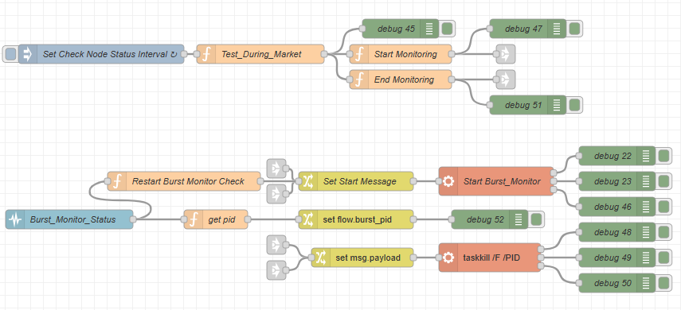

# Node-Red Automation of Burst Monitor Data Capture

In order to capture and act on High Frequency Trading Events the first thing that is needed is a stream of captured data.  This needs to be captured in near real time and it needs to be stored in an organized format so that it can be retrieved for the purpose of further analysis and model training.  It also needs to be immediately available to enable the detection of events and the publishing of those events and the executions of trades based on these events.

The automation of this process is implemented in Node-Red.  The Program Operation Plan (POP) is to have an Inject Node (SetCheck\_Node\_Status\_Interval) generate an interval based stimulus every one minute between 8 AM and 5 PM and to have a separate Function Node (Test\_During\_Market) set a global variable (MonitoringActive) that indicates that the data monitoring should be active.  The Start\_Monitoring and End\_Monitoring function issue a message when MonitoringActive this first goes active and when it first goes inactive.  These messages are to start and stop the data capture processes at preprogrammed times.

If a node unexpectedly goes inactive as evidence by a transition monitored by a Status node from having a PID or Running to any other state and MonitoringActive is True an attempt is made to restart the process.

When the End\_Monitoring message is generated an attempt is made to stop the Monitoring process.

The figure below provides an overview of how this process monitoring works.  The top set of nodes execute the time monitoring and trigger generation functions.  Set\_Check\_Node\_Status\_Interval generates a message on a once a minute basis which feeds the function Test\_During\_Market.  The On Start Method of Test\_During\_Market contains the definition of two times, Start\_Monitoring and End\_ Monitoring and the On Message Method set a global variable MonitoringActive to either True or False depending on whether the current time is between the Start and End Monitoring Times.  Start\_Monitoring and End\_Monitoring generate trigger messages when the desired interval starts and ends. &#x20;

The lower set of nodes accepts the triggers from various sources and supervise the running process.  The Set\_Start\_Message Function attempts to start the process, in this case, Burst\_Monitor, when it recieves a trigger from a button press on the dashboard or a trigger from Start\_Monitoring described above.  This function can also be triggered by a message from Restart\_Burst\_Monitor\_Check which receives message about state changes from the Burst\_Monitor\_Status Node.  If the message.status.text message from Burst\_Monitor\_Status  contains a process ID this is stored in a flow level variable named burst\_id by Set\_Flow\_Burst\_PID, that can later be recovered by the Set\_Msg\_Payload switch that feeds the TaskKill by PID node.  This process is triggered either by a Button press on the dashboard or the End\_Monitoring Trigger message.

In summary, the operation of this starts the Burst\_Monitor at the preprogrammed time, monitors it's status to see if anything causes it to terminate unexpectedly during the time that data capture should be occurring and restarts the process if it does.  When the predetermined time to end the data capture arrives, the process is terminated. outside of the predetermined times, the Burst\_Monitor can be started and stopped manually by using Buttons on the UI Dashboard.

<figure><figcaption>
Overview of Node-Red Process Monitoring
</figcaption></figure>

The running of the Burst\_Monitor program reads an incoming data feed and generates a number of .csv files that are updated in near real time during the day.  In order to monitor data arriving for events of interest and to extract data into usable dataframes a separate process call Burst Streaming is used. This process is implemented as a Python Script currently named Burst\_Stream,py.  The control of this process follows the same general supervision plan that is described above with the addition of an internal mqtt capability that can listen for requests to gracefully stop the process, preserve the state of the capture process during the session and to publish event and other information to other programs operating with the overall application framework.

At the end of the daily session information from various data feeds are combined into dataframes that are used for archival storage for training data and algorithm backtesting. The supervision of this post session process is described in other sections of this document.

