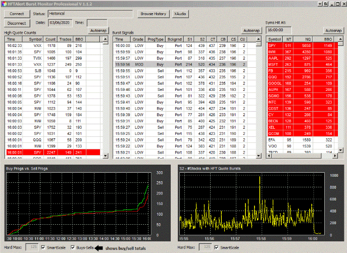

# Ki2_Alerts

Project to read and process HFT data generated by the HFT Alerts Burst Monitor

## Executive Summary

The primary thesis of this project is that there are fingerprints left by the various players in the HFT space that manifest themselves in the fluctuations in the order book both for individual securities and sets of individual securities as well as the options on those securities that can be observed and used as factors in algorithms that predict short term movement in the price of the those securities.

A company (HFTAlert) has leveraged decades of experience monitoring state of the art market feeds originally from Nanex to create a dashboard product named "Burst Monitor" that displays realtime information about High Frequency Trading Bursts (HFT).  A Subscription to this data feed is available at (URL to be added).

Briefly, the Burst Monitor is a software product offered by HFTAlert. Its primary function is to detect High Frequency Trading (HFT) and automated portfolio trading activity in real time.

  

Key aspects of the Burst Monitor include:

• Detection Capabilities: It identifies issues with excessive quotation activity, such as "quote stuffing". It also lists issues targeted by large HFT and portfolio "program bursts".

• "Cappers": Very large program bursts are specifically referred to as "Cappers," which typically indicate the end of an intraday price range, after which the price reverses.

• Information Display: The detected information is displayed in tabular and graphic formats. You can also monitor the total number of buy and sell programs graphically to see when they start to ramp up or when one overtakes the other.

• Capture of Relevant Data: The data that is captured to create the displays is archived in real-time into a set of data files that can be used as the basis for further analysis to support individual developers working on monitoring algorithms or automated trading applications.

The objective of this project is to provide a capability to ingest this data in near realtime into dataframes for further processing.  It also includes scanning functions that can generate alerts based on programmable threshold parameters.

Using these captured dataframes, a variety of analysis functions will be generated looking for tradeable edges.

A Discord Community will be implemented to provide a forum for individuals interested in working with the data to interact with each other to evaluate approaches and algortihms as well as to suggest new algortihms that the community can implement.

Further information, including the URL needed for the subscription, the code including Jypyter notebooks, Python code and documentation will be posted to the project in very near future.

Welcome to the Ki2_Alerts Community ... thanks for playing.